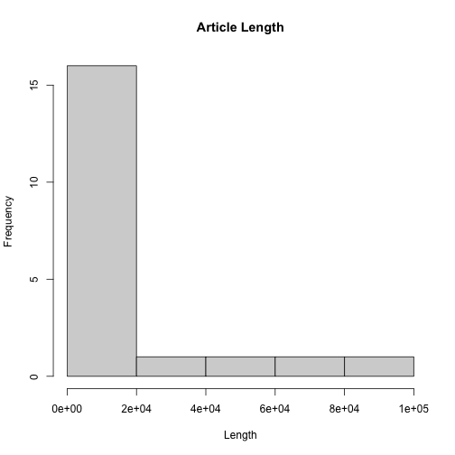
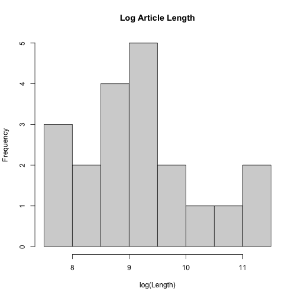
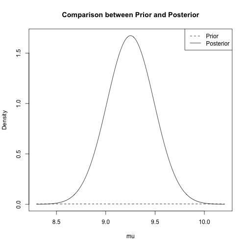

# Assignment 1

## Problem 1

Assume that reviews of Movie $i$ have a common probability $p_i$ of being positive and independent. Assume $U(0, 1)$ prior on each $p_i$.


| | Positive | Not Positive | Total | 
| - | --- | ---| --- |
| Movie 1 | 425 | 75 | 500 |
| Movie 2 | 9 | 1 | 10 |


### 1. Determine the posterior distribution of $p_1$ and $p_2$ separately.

1. Priors:

$$
\begin{align*}
    &\because p_i \sim U(0, 1) \\
    &\therefore p_1 \sim U(0, 1) \quad p_2 \sim U(0, 1)
\end{align*}
$$

2. Sampling Distribution

- As the reviews are either `positive` or `not positive`, so the sampling distribution for each $p_i$ is `Binomial`.

- $p(y = 425 \mid p_1) \sim Bin(500, p_1)$ 

$$
\begin{align*}
  p(y = 425 \mid p_1) 
    &= \begin{pmatrix} 500 \\ 425\end{pmatrix} p_1^{425} (1 - p_1)^{75}\\
    &\propto p_1^{425} (1 - p_1)^{75}
\end{align*}
$$


- $p(y = 9 \mid p_2) \sim Bin(10, p_2)$ 

$$
\begin{align*}
  p(y = 9 \mid p_2) 
    &= \begin{pmatrix} 10 \\ 9\end{pmatrix} p_2^{9} (1 - p_2)\\
    &\propto p_2^{9} (1 - p_2)
\end{align*}
$$

3. Posterior Distribution

- $p(p_1 | y = 425)$

$$
\begin{align*}
&p(p_1 \mid y = 425) \propto 1 \cdot p_1^{425} (1 - p_1)^{75} \\
&\implies p_1 \mid y = 425 \sim Beta(426, 76)
\end{align*}
$$

- $p(p_2 | y = 9)$

$$
\begin{align*}
&p(p_2 \mid y = 9) \propto 1 \cdot p_2^{9} (1 - p_2) \\
&\implies p_2 \mid y = 9 \sim Beta(10, 2)
\end{align*}
$$

- Answers
$$
\boxed{ p_1 \mid y = 425 \sim Beta(426, 76) \quad p_2 \mid y = 9 \sim Beta(10, 2)}
$$


### 2. Which movie ranks higher?


``` r
# parameters
p1.alpha <- 426
p1.beta <- 76
p2.alpha <- 10
p2.beta <- 2

# summary function
beta_summary <- function(alpha, beta) {
    data.frame(
        mean = alpha / (alpha + beta),
        mode = (alpha - 1) / (alpha + beta - 2),
        median = qbeta(0.5, alpha, beta)
    )
}

# generate summary
p1 <- beta_summary(p1.alpha, p1.beta)
p2 <- beta_summary(p2.alpha, p2.beta)
higher_rank <- data.frame(
    mean = ifelse(p1$mean > p2$mean, "p1", "p2"),
    mode = ifelse(p1$mode > p2$mode, "p1", "p2"),
    median = ifelse(p1$median > p2$median, "p1", "p2")
)
result <- rbind(p1, p2, higher_rank)
rownames(result) = c("p1", "p2", "higher rank")
result
```

```
##                          mean mode            median
## p1          0.848605577689243 0.85 0.849068693158005
## p2          0.833333333333333  0.9 0.852036574569394
## higher rank                p1   p2                p2
```

---

## Problem 2

### a. Complete the following using R 

### a.i. Display a histogram 

- Given the following histogram and summary, we can know that the distribution is strongly right-skewed $(mean > median)$.


``` r
data <- read.table("./Random Wikipedia.txt", header = TRUE)
hist(data$bytes, xlab = "Length", main = "Article Length")
```



``` r
summary(data$bytes)
```

```
##    Min. 1st Qu.  Median    Mean 3rd Qu.    Max. 
##    2132    4982   10294   18827   16806   86979
```

---

### a.ii. Transforming article length to the log scale

- After rescaling the distribution with natural log, the distribution is more symmetrical now $(mean \approx median)$


``` r
log_length <- log(data$bytes)
hist(log_length, xlab = "log(Length)", main = "Log Article Length")
```



``` r
summary(log_length)
```

```
##    Min. 1st Qu.  Median    Mean 3rd Qu.    Max. 
##   7.665   8.512   9.238   9.252   9.727  11.373
```

---

### a.iii. Transforming article length to the log scale

- Log scale improves the reliability of the mean value as it reduces the impact of the outliers on the mean value.

---

### b. Compute the sample mean and sample variance


``` r
n <- length(log_length)
y_bar <- mean(log_length)
s.2 <- var(log_length)

results <- data.frame(mean = y_bar, variance=s.2)
colnames(results) = c("sample mean", "sample variance")
results
```

```
##   sample mean sample variance
## 1     9.25151        1.138061
```

---

### c. Assume $y \sim N(\mu, \sigma^2)$, $\sigma^2 = s^2$ and the prior is flat for $\mu$

### c.i. Posterior Mean, Posterior Variance, and Posterior Precision

##### Prior

- Given that prior is flat, 

$$
p(\mu) \propto 1 \quad (\mu \in (-\infty, \infty))
$$

##### Sampling Distribution

- Let random variables $y_1, \dots, y_{20}$ be a random vector $y$

$$
\begin{align*}
    &y \mid \mu, \sigma^2 \sim N(\mu, \sigma^2) \\
    &p(y \mid \mu, \sigma^2) = \frac{1}{\sqrt{2 \pi \sigma^2}} \exp\left(-\frac{1}{2\sigma^2} (y - \mu)^2\right) \\
   &p(y \mid \mu, \sigma^2) \propto \frac{1}{\sigma} \exp\left(-\frac{n-1}{2\sigma^2} s^2\right) \exp\left(-\frac{n}{2\sigma^2} (\mu -  \bar y)^2\right) \quad \text{(Mean only)}\\
   &p(y \mid \mu) \propto \exp\left(-\frac{n}{2\sigma^2} (\mu -  \bar y)^2\right) \\
\end{align*}
$$

##### Posterior

$$
\begin{align*}
p(\mu \mid y) 
    &\propto p(\mu)p(y \mid \mu) \\
    &\propto 1 \cdot \exp\left(-\frac{n}{2\sigma^2} (\mu -  \bar y)^2\right) \\
    &\propto \exp\left(-\frac{n}{2\sigma^2} (\mu -  \bar y)^2\right) \\
    &\implies \boxed{\mu \mid y \sim N(\bar y, \sigma^2 / n)}
\end{align*}
$$


``` r
# posterior mean
posteriors <- data.frame(
    mu_mean = y_bar,
    mu_variance = s.2 / n,
    mu_precision = n / s.2
)
posteriors
```

```
##   mu_mean mu_variance mu_precision
## 1 9.25151  0.05690307     17.57374
```


---

### c.ii. Comparison between Prior $\mu$ and Posterior $\mu \mid y$


``` r
# Posterior density
post_std <-sqrt(posteriors$mu_variance) 
curve(
    dnorm(x, posteriors$mu_mean, post_std), 
    from = posteriors$mu_mean - 4 * post_std, 
    to = posteriors$mu_mean + 4 * post_std,  
    xlab = "mu", 
    ylab = "Density",
    main = "Comparison between Prior and Posterior",
    n = 1000
)

# Prior density
# large variance = 10000 to make prior diffuse -> flat prior
curve(
  dnorm(x, y_bar, 100),
  lty = 2, n = 1000, add = TRUE
)

legend("topright", c("Prior", "Posterior"), lty = c(2, 1))
```




### c.iii. 95% central posterior interval for $\mu$


``` r
qnorm(c(0.025, 0.975), mean=posteriors$mu_mean, sd=post_std)
```

```
## [1] 8.783973 9.719047
```

---

### d. Treat $\sigma^2$ as unknown now, and let $\mu$ and $\sigma^2$ have prior $p(\mu, \sigma^2) \propto (sigma^2)^{-1}$

### d.i. Posterior Mean, Posterior Variance, and Posterior Precision

#### Likelihood from 

$$
p(y \mid \mu, \sigma^2) 
\propto \frac{1}{\sigma} 
        \exp\left(-\frac{n-1}{2\sigma^2} s^2\right) 
        \exp\left(-\frac{n}{2\sigma^2} (\mu -  \bar y)^2\right) 
$$

#### Posterior

$$
\begin{align*}
    p(\mu \mid y) 
        &\propto  p(y \mid \mu, \sigma^2) p(\mu, \sigma^2) \\
        &\propto \frac{1}{\sigma} 
                 \exp\left(-\frac{n-1}{2\sigma^2} s^2\right) 
                 \exp\left(-\frac{n}{2\sigma^2} (\mu -  \bar y)^2\right)  
                 \cdot (\sigma^2)^{-1} \\
        &\implies \boxed{\mu \mid \sigma^2, y \sim N(\bar y, \sigma^2 / n)} \\
        &\implies \boxed{\sigma^2 \mid y \sim Inv-\chi^2(n - 1, s^2)}
\end{align*}
$$

#### Posterior Mean, Posterior Variance, Posterior Precision

- We simulate $\sigma^2$ by sampling $X$ from $\chi^2$ distribution and rewrite the $\sigma^2$ distribution as: 

$$
\sigma^2_{sim} = \frac{(n - 1) s^2}{X} \quad X \sim \chi^2_{n - 1}
$$


``` r
# simulation
sigma_sim.2 <- (n - 1) * s.2 / rchisq(1000000, n - 1)
mu_sim <- rnorm(1000000, y_bar, sqrt(sigma_sim.2 / n))

posteriors <- data.frame(
    mu_mean = mean(mu_sim),
    mu_variance = var(mu_sim),
    mu_precision = 1 / var(mu_sim)
)
posteriors
```

```
##    mu_mean mu_variance mu_precision
## 1 9.251515  0.06362054     15.71819
```

---

### d.ii. 95% central posterior interval for $\mu$


``` r
quantile(mu_sim, c(0.025,0.975))
```

```
##     2.5%    97.5% 
## 8.752103 9.751871
```

---

### d.ii. 95% central posterior interval for $\sigma^2$


``` r
quantile(sigma_sim.2, c(0.025,0.975))
```

```
##     2.5%    97.5% 
## 0.657732 2.427778
```

---

### e. 1,000,000 draws from the posterior


``` r
N = 1000000
sigma_sim.2 <- (n - 1) * s.2 / rchisq(N, n - 1)
mu_sim <- rnorm(N, y_bar, sqrt(sigma_sim.2 / n))
post.pred <- exp(rnorm(N, mu_sim, sqrt(sigma_sim.2)))
```

### e.i. 95% central posterior predictive interval for the length


``` r
quantile(post.pred, c(0.025, 0.975))
```

```
##       2.5%      97.5% 
##   1062.023 103285.394
```

---

### e.ii. The posterior predictive probability that min length of a newly selected articles will be less than the minimum article length in the original data


``` r
min_length <- min(data$bytes)
mean(post.pred < min_length)
```

```
## [1] 0.081359
```

---

### e.iii. The posterior predictive probability that min length of 20 newly selected articles will be less than the minimum article length in the data


``` r
records <- logical(N)
for (i in seq_len(N)) {
    cur_samples <- exp(rnorm(20, mu_sim[i], sqrt(sigma_sim.2[i])))
    records[i] <- min(cur_samples) < min_length
}
mean(records)
```

```
## [1] 0.734661
```

