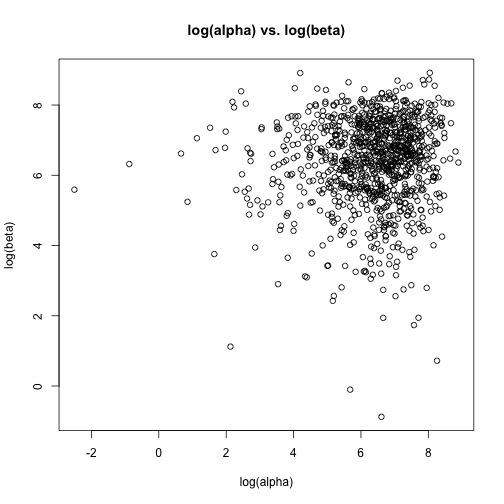
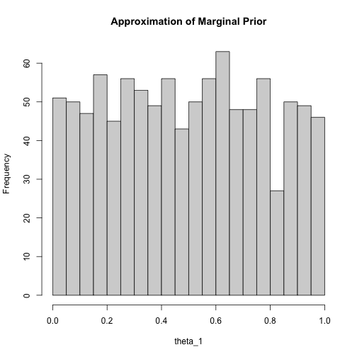
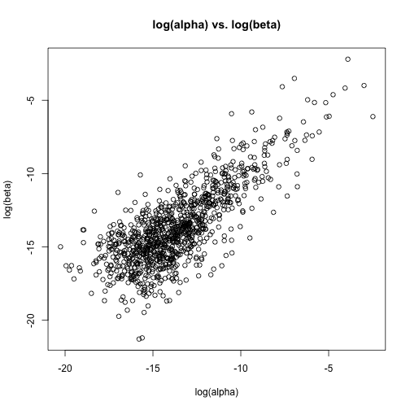
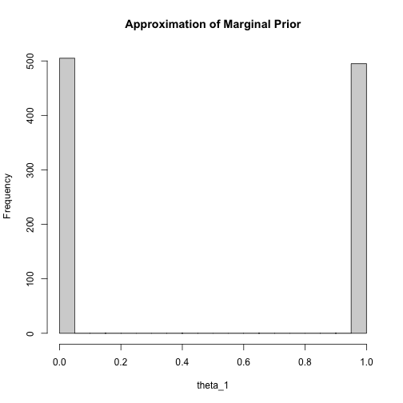
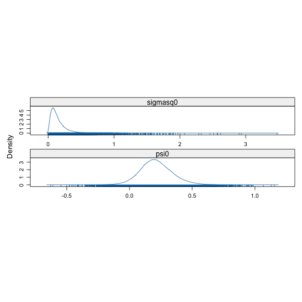

# Assignment 2

## Problem 1

## a. 

$$
\begin{align*}
    &\theta_j \mid \alpha, \beta \sim Beta(\alpha, \beta) \\
    &\alpha, \beta \sim iid \quad Expon(0.001)
\end{align*}
$$

### a.i. Simulate 1000 $(\alpha, \beta)$ pairs and produce a scatter plot of $log(\alpha)$ and $log(\beta)$


``` r
alpha <- rexp(1000, 0.001)
beta <- rexp(1000, 0.001)
plot(
    log(alpha), 
    log(beta), 
    main="log(alpha) vs. log(beta)", 
    xlab="log(alpha)", 
    ylab="log(beta)"
)
```



### a.ii. Forward simulate $\theta_1$ and produce a histogram


``` r
theta_1 <- rbeta(1000, alpha, beta)
hist(theta_1, breaks = 30, main="Approximation of Marginal Prior")
```



## b. 

$$
\begin{align*}
    &\theta_j \mid \alpha, \beta \sim Beta(\alpha, \beta) \\
    &\alpha = \frac{\phi_1}{\phi^2_2} \quad \beta = \frac{(1 - \phi_1)}{\phi_2^2} \\
    &\phi_1 \sim U(0, 1) \quad \phi_2 \sim Expon(0.001) \\
\end{align*}
$$

### b.i.  Independently simulate 1000 pairs $(\alpha, \beta)$ from their hyperprior and produce a scatter plot of $log(\alpha)$ and $log(\beta)$


``` r
phi_1 <- runif(1000) 
phi_2 <- rexp(1000, 0.001)
alpha <- phi_1 / phi_2^2
beta <- (1 - phi_1) / phi_2^2

plot(
    log(alpha), 
    log(beta), 
    main="log(alpha) vs. log(beta)", 
    xlab="log(alpha)", 
    ylab="log(beta)"
)
```



### b.ii. Forward simulate $\theta_1$ and produce a histogram


``` r
theta_1 <- rbeta(1000, alpha, beta)
hist(theta_1, breaks = 30, main="Approximation of Marginal Prior")
```




## Problem 2

$$
\begin{align*}
    &\hat\psi_j \mid \psi_j \sim \;\; indep.\;\; N(\psi_j, \sigma^2_j) \quad j = 1, \dots, 12 \\
    &\psi_j \mid \psi_0, \sigma_0 \sim \;\; iid \;\; N(\psi_0, \sigma_0^2) \quad j = 1, \dots, 12 \\
    &\psi_0 \sim N(0, 1000^2) \\
    &\sigma_0 \sim U(0, 1000) 
\end{align*}
$$

where  

- $\psi_0$ and $\sigma_0$ are independent.
- $\sigma_j,\; j = 1, \dots, 12$ are fixed and known.


## a. For each hyperparameter, specify an improper density

### hyperparamters

- $\sigma_0$
- $\psi_0$

### Improper densities

#### $N(0, 1000^2)$

- The hyperprior of $\psi_0$, $N(0, 1000^2)$, is rather disperse given the variance $1000^2$.
- Apparently, it approximates $\psi_0 \propto 1 \quad \psi_0 \in \mathbb{R}$, an improper uniform prior on the real line.

#### $U(0, 1000)$

- The hyperprior of $\sigma_0$, $U(0, 1000)$ is rather disperse as its upper bound is rather large.
- Apparently, it approximates $\sigma_0 \propto 1 \quad \sigma_0 > 0$, an improper uniform prior on the real line.


## b. Draw a DAG for the model

 

## c. Show the JAGS code

```txt
model {
  for (j in 1:length(psihat)) {
    psihat[j] ~ dnorm(psi[j], 1/(se[j]^2))
    psi[j] ~ dnorm(psi0, 1/sigmasq0) 
  }

  psi0 ~ dnorm(0, 0.000001)
  sigma0 ~ dunif(0, 1000)

  sigmasq0 <- sigma0^2 
}

```

## d. Set up the rjag model


``` r
library("rjags")
```

```
## Loading required package: coda
```

```
## Linked to JAGS 4.3.2
```

```
## Loaded modules: basemod,bugs
```

``` r
d <- read.table("./Heart Studies.txt")
colnames(d) <- c("i", "psihat", "se")
m <- jags.model("./asgn2template.bug", d)
```

```
## Warning in jags.model("./asgn2template.bug", d): Unused variable "i" in data
```

```
## Compiling model graph
##    Resolving undeclared variables
##    Allocating nodes
## Graph information:
##    Observed stochastic nodes: 12
##    Unobserved stochastic nodes: 14
##    Total graph size: 69
## 
## Initializing model
## 
## 
  |                                                        
  |                                                  |   0%
  |                                                        
  |+                                                 |   2%
  |                                                        
  |++                                                |   4%
  |                                                        
  |+++                                               |   6%
  |                                                        
  |++++                                              |   8%
  |                                                        
  |+++++                                             |  10%
  |                                                        
  |++++++                                            |  12%
  |                                                        
  |+++++++                                           |  14%
  |                                                        
  |++++++++                                          |  16%
  |                                                        
  |+++++++++                                         |  18%
  |                                                        
  |++++++++++                                        |  20%
  |                                                        
  |+++++++++++                                       |  22%
  |                                                        
  |++++++++++++                                      |  24%
  |                                                        
  |+++++++++++++                                     |  26%
  |                                                        
  |++++++++++++++                                    |  28%
  |                                                        
  |+++++++++++++++                                   |  30%
  |                                                        
  |++++++++++++++++                                  |  32%
  |                                                        
  |+++++++++++++++++                                 |  34%
  |                                                        
  |++++++++++++++++++                                |  36%
  |                                                        
  |+++++++++++++++++++                               |  38%
  |                                                        
  |++++++++++++++++++++                              |  40%
  |                                                        
  |+++++++++++++++++++++                             |  42%
  |                                                        
  |++++++++++++++++++++++                            |  44%
  |                                                        
  |+++++++++++++++++++++++                           |  46%
  |                                                        
  |++++++++++++++++++++++++                          |  48%
  |                                                        
  |+++++++++++++++++++++++++                         |  50%
  |                                                        
  |++++++++++++++++++++++++++                        |  52%
  |                                                        
  |+++++++++++++++++++++++++++                       |  54%
  |                                                        
  |++++++++++++++++++++++++++++                      |  56%
  |                                                        
  |+++++++++++++++++++++++++++++                     |  58%
  |                                                        
  |++++++++++++++++++++++++++++++                    |  60%
  |                                                        
  |+++++++++++++++++++++++++++++++                   |  62%
  |                                                        
  |++++++++++++++++++++++++++++++++                  |  64%
  |                                                        
  |+++++++++++++++++++++++++++++++++                 |  66%
  |                                                        
  |++++++++++++++++++++++++++++++++++                |  68%
  |                                                        
  |+++++++++++++++++++++++++++++++++++               |  70%
  |                                                        
  |++++++++++++++++++++++++++++++++++++              |  72%
  |                                                        
  |+++++++++++++++++++++++++++++++++++++             |  74%
  |                                                        
  |++++++++++++++++++++++++++++++++++++++            |  76%
  |                                                        
  |+++++++++++++++++++++++++++++++++++++++           |  78%
  |                                                        
  |++++++++++++++++++++++++++++++++++++++++          |  80%
  |                                                        
  |+++++++++++++++++++++++++++++++++++++++++         |  82%
  |                                                        
  |++++++++++++++++++++++++++++++++++++++++++        |  84%
  |                                                        
  |+++++++++++++++++++++++++++++++++++++++++++       |  86%
  |                                                        
  |++++++++++++++++++++++++++++++++++++++++++++      |  88%
  |                                                        
  |+++++++++++++++++++++++++++++++++++++++++++++     |  90%
  |                                                        
  |++++++++++++++++++++++++++++++++++++++++++++++    |  92%
  |                                                        
  |+++++++++++++++++++++++++++++++++++++++++++++++   |  94%
  |                                                        
  |++++++++++++++++++++++++++++++++++++++++++++++++  |  96%
  |                                                        
  |+++++++++++++++++++++++++++++++++++++++++++++++++ |  98%
  |                                                        
  |++++++++++++++++++++++++++++++++++++++++++++++++++| 100%
```

``` r
print(d)
```

```
##     i psihat    se
## 1   1  1.055 0.373
## 2   2 -0.097 0.116
## 3   3  0.626 0.229
## 4   4  0.017 0.117
## 5   5  1.068 0.471
## 6   6 -0.025 0.120
## 7   7 -0.117 0.220
## 8   8 -0.381 0.239
## 9   9  0.507 0.186
## 10 10  0.000 0.328
## 11 11  0.385 0.206
## 12 12  0.405 0.254
```

## e. Run the model and retrieve numerical summaries for the posterior $\psi_0$ and $\sigma_0^2$


``` r
update(m, 10000)
```

```
## 
  |                                                        
  |                                                  |   0%
  |                                                        
  |*                                                 |   2%
  |                                                        
  |**                                                |   4%
  |                                                        
  |***                                               |   6%
  |                                                        
  |****                                              |   8%
  |                                                        
  |*****                                             |  10%
  |                                                        
  |******                                            |  12%
  |                                                        
  |*******                                           |  14%
  |                                                        
  |********                                          |  16%
  |                                                        
  |*********                                         |  18%
  |                                                        
  |**********                                        |  20%
  |                                                        
  |***********                                       |  22%
  |                                                        
  |************                                      |  24%
  |                                                        
  |*************                                     |  26%
  |                                                        
  |**************                                    |  28%
  |                                                        
  |***************                                   |  30%
  |                                                        
  |****************                                  |  32%
  |                                                        
  |*****************                                 |  34%
  |                                                        
  |******************                                |  36%
  |                                                        
  |*******************                               |  38%
  |                                                        
  |********************                              |  40%
  |                                                        
  |*********************                             |  42%
  |                                                        
  |**********************                            |  44%
  |                                                        
  |***********************                           |  46%
  |                                                        
  |************************                          |  48%
  |                                                        
  |*************************                         |  50%
  |                                                        
  |**************************                        |  52%
  |                                                        
  |***************************                       |  54%
  |                                                        
  |****************************                      |  56%
  |                                                        
  |*****************************                     |  58%
  |                                                        
  |******************************                    |  60%
  |                                                        
  |*******************************                   |  62%
  |                                                        
  |********************************                  |  64%
  |                                                        
  |*********************************                 |  66%
  |                                                        
  |**********************************                |  68%
  |                                                        
  |***********************************               |  70%
  |                                                        
  |************************************              |  72%
  |                                                        
  |*************************************             |  74%
  |                                                        
  |**************************************            |  76%
  |                                                        
  |***************************************           |  78%
  |                                                        
  |****************************************          |  80%
  |                                                        
  |*****************************************         |  82%
  |                                                        
  |******************************************        |  84%
  |                                                        
  |*******************************************       |  86%
  |                                                        
  |********************************************      |  88%
  |                                                        
  |*********************************************     |  90%
  |                                                        
  |**********************************************    |  92%
  |                                                        
  |***********************************************   |  94%
  |                                                        
  |************************************************  |  96%
  |                                                        
  |************************************************* |  98%
  |                                                        
  |**************************************************| 100%
```

``` r
x <- coda.samples(m, c("psi0", "sigmasq0"), 100000)
```

```
## 
  |                                                        
  |                                                  |   0%
  |                                                        
  |*                                                 |   2%
  |                                                        
  |**                                                |   4%
  |                                                        
  |***                                               |   6%
  |                                                        
  |****                                              |   8%
  |                                                        
  |*****                                             |  10%
  |                                                        
  |******                                            |  12%
  |                                                        
  |*******                                           |  14%
  |                                                        
  |********                                          |  16%
  |                                                        
  |*********                                         |  18%
  |                                                        
  |**********                                        |  20%
  |                                                        
  |***********                                       |  22%
  |                                                        
  |************                                      |  24%
  |                                                        
  |*************                                     |  26%
  |                                                        
  |**************                                    |  28%
  |                                                        
  |***************                                   |  30%
  |                                                        
  |****************                                  |  32%
  |                                                        
  |*****************                                 |  34%
  |                                                        
  |******************                                |  36%
  |                                                        
  |*******************                               |  38%
  |                                                        
  |********************                              |  40%
  |                                                        
  |*********************                             |  42%
  |                                                        
  |**********************                            |  44%
  |                                                        
  |***********************                           |  46%
  |                                                        
  |************************                          |  48%
  |                                                        
  |*************************                         |  50%
  |                                                        
  |**************************                        |  52%
  |                                                        
  |***************************                       |  54%
  |                                                        
  |****************************                      |  56%
  |                                                        
  |*****************************                     |  58%
  |                                                        
  |******************************                    |  60%
  |                                                        
  |*******************************                   |  62%
  |                                                        
  |********************************                  |  64%
  |                                                        
  |*********************************                 |  66%
  |                                                        
  |**********************************                |  68%
  |                                                        
  |***********************************               |  70%
  |                                                        
  |************************************              |  72%
  |                                                        
  |*************************************             |  74%
  |                                                        
  |**************************************            |  76%
  |                                                        
  |***************************************           |  78%
  |                                                        
  |****************************************          |  80%
  |                                                        
  |*****************************************         |  82%
  |                                                        
  |******************************************        |  84%
  |                                                        
  |*******************************************       |  86%
  |                                                        
  |********************************************      |  88%
  |                                                        
  |*********************************************     |  90%
  |                                                        
  |**********************************************    |  92%
  |                                                        
  |***********************************************   |  94%
  |                                                        
  |************************************************  |  96%
  |                                                        
  |************************************************* |  98%
  |                                                        
  |**************************************************| 100%
```

``` r
psi0 <- as.matrix(x)[, "psi0"]
sigmasq0 <- as.matrix(x)[, "sigmasq0"]
subset(summary(x)$statistics, select = c("Mean", "SD"))
```

```
##               Mean        SD
## psi0     0.2141123 0.1331245
## sigmasq0 0.1512326 0.1345881
```

``` r
quantile(psi0, c(0.025, 0.975))
```

```
##        2.5%       97.5% 
## -0.03226226  0.49726796
```

``` r
quantile(sigmasq0, c(0.025, 0.975))
```

```
##       2.5%      97.5% 
## 0.01911394 0.49562158
```

``` r
require("lattice")
```

```
## Loading required package: lattice
```

``` r
densityplot(x[, c("psi0", "sigmasq0")])
```



### e.i. The posterior numerical summary of $\psi_0$ 

- **Expected Value**: $0.2146998$
- **Standard Deviation**: $0.1326329$ 
- **95% Central Interval**: $[-0.03265995 0.49480561]$


### e.ii.The posterior numerical summary of $\sigma^2_0$ 

- **Expected Value**: $0.1508600$
- **Standard Deviation**: $0.1363831$  
- **95% Central Interval**: $[0.0188346 0.4858067]$

## f. With newly added case-control study

### f.i. Draw the updated DAG

- Since the newly added study are conditionally independent of previous studies give $\psi_0$ and $\sigma_0$, we can modify the DAG as follows:

 

where

- $\sigma_{13}$: The log-odds standard error of the new study ($\sigma_{13} = 0.4$)
- $\hat\psi_{13}$: The new estimated logs-odds ratio
- $\psi_{13}$: The new logs-odds ratio

### f.ii. Modified JAGS Model

```txt
model {
  for (j in 1:length(psihat)) {
    psihat[j] ~ dnorm(psi[j], 1/(se[j]^2))
    psi[j] ~ dnorm(psi0, 1/sigmasq0) 
  }

  psi0 ~ dnorm(0, 0.000001)
  sigma0 ~ dunif(0, 1000)
  sigmasq0 <- sigma0^2 

  psi_13 ~ dnorm(psi0, 1/sigmasq0)
  psihat_13 ~ dnorm(psi_13, 6.25)
}
```

### f.iii. Retrieve numerical summaries for the posterior $\hat\psi_{13}$


``` r
m <- jags.model("./updated_asgn2template.bug", d)
```

```
## Warning in jags.model("./updated_asgn2template.bug", d): Unused variable "i"
## in data
```

```
## Compiling model graph
##    Resolving undeclared variables
##    Allocating nodes
## Graph information:
##    Observed stochastic nodes: 12
##    Unobserved stochastic nodes: 16
##    Total graph size: 72
## 
## Initializing model
## 
## 
  |                                                        
  |                                                  |   0%
  |                                                        
  |+                                                 |   2%
  |                                                        
  |++                                                |   4%
  |                                                        
  |+++                                               |   6%
  |                                                        
  |++++                                              |   8%
  |                                                        
  |+++++                                             |  10%
  |                                                        
  |++++++                                            |  12%
  |                                                        
  |+++++++                                           |  14%
  |                                                        
  |++++++++                                          |  16%
  |                                                        
  |+++++++++                                         |  18%
  |                                                        
  |++++++++++                                        |  20%
  |                                                        
  |+++++++++++                                       |  22%
  |                                                        
  |++++++++++++                                      |  24%
  |                                                        
  |+++++++++++++                                     |  26%
  |                                                        
  |++++++++++++++                                    |  28%
  |                                                        
  |+++++++++++++++                                   |  30%
  |                                                        
  |++++++++++++++++                                  |  32%
  |                                                        
  |+++++++++++++++++                                 |  34%
  |                                                        
  |++++++++++++++++++                                |  36%
  |                                                        
  |+++++++++++++++++++                               |  38%
  |                                                        
  |++++++++++++++++++++                              |  40%
  |                                                        
  |+++++++++++++++++++++                             |  42%
  |                                                        
  |++++++++++++++++++++++                            |  44%
  |                                                        
  |+++++++++++++++++++++++                           |  46%
  |                                                        
  |++++++++++++++++++++++++                          |  48%
  |                                                        
  |+++++++++++++++++++++++++                         |  50%
  |                                                        
  |++++++++++++++++++++++++++                        |  52%
  |                                                        
  |+++++++++++++++++++++++++++                       |  54%
  |                                                        
  |++++++++++++++++++++++++++++                      |  56%
  |                                                        
  |+++++++++++++++++++++++++++++                     |  58%
  |                                                        
  |++++++++++++++++++++++++++++++                    |  60%
  |                                                        
  |+++++++++++++++++++++++++++++++                   |  62%
  |                                                        
  |++++++++++++++++++++++++++++++++                  |  64%
  |                                                        
  |+++++++++++++++++++++++++++++++++                 |  66%
  |                                                        
  |++++++++++++++++++++++++++++++++++                |  68%
  |                                                        
  |+++++++++++++++++++++++++++++++++++               |  70%
  |                                                        
  |++++++++++++++++++++++++++++++++++++              |  72%
  |                                                        
  |+++++++++++++++++++++++++++++++++++++             |  74%
  |                                                        
  |++++++++++++++++++++++++++++++++++++++            |  76%
  |                                                        
  |+++++++++++++++++++++++++++++++++++++++           |  78%
  |                                                        
  |++++++++++++++++++++++++++++++++++++++++          |  80%
  |                                                        
  |+++++++++++++++++++++++++++++++++++++++++         |  82%
  |                                                        
  |++++++++++++++++++++++++++++++++++++++++++        |  84%
  |                                                        
  |+++++++++++++++++++++++++++++++++++++++++++       |  86%
  |                                                        
  |++++++++++++++++++++++++++++++++++++++++++++      |  88%
  |                                                        
  |+++++++++++++++++++++++++++++++++++++++++++++     |  90%
  |                                                        
  |++++++++++++++++++++++++++++++++++++++++++++++    |  92%
  |                                                        
  |+++++++++++++++++++++++++++++++++++++++++++++++   |  94%
  |                                                        
  |++++++++++++++++++++++++++++++++++++++++++++++++  |  96%
  |                                                        
  |+++++++++++++++++++++++++++++++++++++++++++++++++ |  98%
  |                                                        
  |++++++++++++++++++++++++++++++++++++++++++++++++++| 100%
```

``` r
update(m, 10000)
```

```
## 
  |                                                        
  |                                                  |   0%
  |                                                        
  |*                                                 |   2%
  |                                                        
  |**                                                |   4%
  |                                                        
  |***                                               |   6%
  |                                                        
  |****                                              |   8%
  |                                                        
  |*****                                             |  10%
  |                                                        
  |******                                            |  12%
  |                                                        
  |*******                                           |  14%
  |                                                        
  |********                                          |  16%
  |                                                        
  |*********                                         |  18%
  |                                                        
  |**********                                        |  20%
  |                                                        
  |***********                                       |  22%
  |                                                        
  |************                                      |  24%
  |                                                        
  |*************                                     |  26%
  |                                                        
  |**************                                    |  28%
  |                                                        
  |***************                                   |  30%
  |                                                        
  |****************                                  |  32%
  |                                                        
  |*****************                                 |  34%
  |                                                        
  |******************                                |  36%
  |                                                        
  |*******************                               |  38%
  |                                                        
  |********************                              |  40%
  |                                                        
  |*********************                             |  42%
  |                                                        
  |**********************                            |  44%
  |                                                        
  |***********************                           |  46%
  |                                                        
  |************************                          |  48%
  |                                                        
  |*************************                         |  50%
  |                                                        
  |**************************                        |  52%
  |                                                        
  |***************************                       |  54%
  |                                                        
  |****************************                      |  56%
  |                                                        
  |*****************************                     |  58%
  |                                                        
  |******************************                    |  60%
  |                                                        
  |*******************************                   |  62%
  |                                                        
  |********************************                  |  64%
  |                                                        
  |*********************************                 |  66%
  |                                                        
  |**********************************                |  68%
  |                                                        
  |***********************************               |  70%
  |                                                        
  |************************************              |  72%
  |                                                        
  |*************************************             |  74%
  |                                                        
  |**************************************            |  76%
  |                                                        
  |***************************************           |  78%
  |                                                        
  |****************************************          |  80%
  |                                                        
  |*****************************************         |  82%
  |                                                        
  |******************************************        |  84%
  |                                                        
  |*******************************************       |  86%
  |                                                        
  |********************************************      |  88%
  |                                                        
  |*********************************************     |  90%
  |                                                        
  |**********************************************    |  92%
  |                                                        
  |***********************************************   |  94%
  |                                                        
  |************************************************  |  96%
  |                                                        
  |************************************************* |  98%
  |                                                        
  |**************************************************| 100%
```

``` r
x <- coda.samples(m, c("psihat_13"), 100000)
```

```
## 
  |                                                        
  |                                                  |   0%
  |                                                        
  |*                                                 |   2%
  |                                                        
  |**                                                |   4%
  |                                                        
  |***                                               |   6%
  |                                                        
  |****                                              |   8%
  |                                                        
  |*****                                             |  10%
  |                                                        
  |******                                            |  12%
  |                                                        
  |*******                                           |  14%
  |                                                        
  |********                                          |  16%
  |                                                        
  |*********                                         |  18%
  |                                                        
  |**********                                        |  20%
  |                                                        
  |***********                                       |  22%
  |                                                        
  |************                                      |  24%
  |                                                        
  |*************                                     |  26%
  |                                                        
  |**************                                    |  28%
  |                                                        
  |***************                                   |  30%
  |                                                        
  |****************                                  |  32%
  |                                                        
  |*****************                                 |  34%
  |                                                        
  |******************                                |  36%
  |                                                        
  |*******************                               |  38%
  |                                                        
  |********************                              |  40%
  |                                                        
  |*********************                             |  42%
  |                                                        
  |**********************                            |  44%
  |                                                        
  |***********************                           |  46%
  |                                                        
  |************************                          |  48%
  |                                                        
  |*************************                         |  50%
  |                                                        
  |**************************                        |  52%
  |                                                        
  |***************************                       |  54%
  |                                                        
  |****************************                      |  56%
  |                                                        
  |*****************************                     |  58%
  |                                                        
  |******************************                    |  60%
  |                                                        
  |*******************************                   |  62%
  |                                                        
  |********************************                  |  64%
  |                                                        
  |*********************************                 |  66%
  |                                                        
  |**********************************                |  68%
  |                                                        
  |***********************************               |  70%
  |                                                        
  |************************************              |  72%
  |                                                        
  |*************************************             |  74%
  |                                                        
  |**************************************            |  76%
  |                                                        
  |***************************************           |  78%
  |                                                        
  |****************************************          |  80%
  |                                                        
  |*****************************************         |  82%
  |                                                        
  |******************************************        |  84%
  |                                                        
  |*******************************************       |  86%
  |                                                        
  |********************************************      |  88%
  |                                                        
  |*********************************************     |  90%
  |                                                        
  |**********************************************    |  92%
  |                                                        
  |***********************************************   |  94%
  |                                                        
  |************************************************  |  96%
  |                                                        
  |************************************************* |  98%
  |                                                        
  |**************************************************| 100%
```

``` r
summary(x)$statistics[c("Mean", "SD")]
```

```
##      Mean        SD 
## 0.2166461 0.5721958
```

``` r
psihat_13 <- as.matrix(x)[, "psihat_13"]
quantile(psihat_13, c(0.025, 0.975))
```

```
##       2.5%      97.5% 
## -0.8938103  1.3611454
```
 
- **Expected Value**: $0.2131864$
- **Standard Deviation**: $0.5690035$
- **95% Central Interval**: $[-0.8987115 1.3548126]$

### f.iv. Add an indicator function to JAGS Model

```
model {
  for (j in 1:length(psihat)) {
    psihat[j] ~ dnorm(psi[j], 1/(se[j]^2))
    psi[j] ~ dnorm(psi0, 1/sigmasq0) 
  }

  psi0 ~ dnorm(0, 0.000001)
  sigma0 ~ dunif(0, 1000)
  sigmasq0 <- sigma0^2 

  psi_13 ~ dnorm(psi0, 1/sigmasq0)
  psihat_13 ~ dnorm(psi_13, 6.25)
  ind <- psihat_13 > 0.8
}
```


``` r
m <- jags.model("./indicator_asgn2template.bug", d)
```

```
## Warning in jags.model("./indicator_asgn2template.bug", d): Unused variable
## "i" in data
```

```
## Compiling model graph
##    Resolving undeclared variables
##    Allocating nodes
## Graph information:
##    Observed stochastic nodes: 12
##    Unobserved stochastic nodes: 16
##    Total graph size: 74
## 
## Initializing model
## 
## 
  |                                                        
  |                                                  |   0%
  |                                                        
  |+                                                 |   2%
  |                                                        
  |++                                                |   4%
  |                                                        
  |+++                                               |   6%
  |                                                        
  |++++                                              |   8%
  |                                                        
  |+++++                                             |  10%
  |                                                        
  |++++++                                            |  12%
  |                                                        
  |+++++++                                           |  14%
  |                                                        
  |++++++++                                          |  16%
  |                                                        
  |+++++++++                                         |  18%
  |                                                        
  |++++++++++                                        |  20%
  |                                                        
  |+++++++++++                                       |  22%
  |                                                        
  |++++++++++++                                      |  24%
  |                                                        
  |+++++++++++++                                     |  26%
  |                                                        
  |++++++++++++++                                    |  28%
  |                                                        
  |+++++++++++++++                                   |  30%
  |                                                        
  |++++++++++++++++                                  |  32%
  |                                                        
  |+++++++++++++++++                                 |  34%
  |                                                        
  |++++++++++++++++++                                |  36%
  |                                                        
  |+++++++++++++++++++                               |  38%
  |                                                        
  |++++++++++++++++++++                              |  40%
  |                                                        
  |+++++++++++++++++++++                             |  42%
  |                                                        
  |++++++++++++++++++++++                            |  44%
  |                                                        
  |+++++++++++++++++++++++                           |  46%
  |                                                        
  |++++++++++++++++++++++++                          |  48%
  |                                                        
  |+++++++++++++++++++++++++                         |  50%
  |                                                        
  |++++++++++++++++++++++++++                        |  52%
  |                                                        
  |+++++++++++++++++++++++++++                       |  54%
  |                                                        
  |++++++++++++++++++++++++++++                      |  56%
  |                                                        
  |+++++++++++++++++++++++++++++                     |  58%
  |                                                        
  |++++++++++++++++++++++++++++++                    |  60%
  |                                                        
  |+++++++++++++++++++++++++++++++                   |  62%
  |                                                        
  |++++++++++++++++++++++++++++++++                  |  64%
  |                                                        
  |+++++++++++++++++++++++++++++++++                 |  66%
  |                                                        
  |++++++++++++++++++++++++++++++++++                |  68%
  |                                                        
  |+++++++++++++++++++++++++++++++++++               |  70%
  |                                                        
  |++++++++++++++++++++++++++++++++++++              |  72%
  |                                                        
  |+++++++++++++++++++++++++++++++++++++             |  74%
  |                                                        
  |++++++++++++++++++++++++++++++++++++++            |  76%
  |                                                        
  |+++++++++++++++++++++++++++++++++++++++           |  78%
  |                                                        
  |++++++++++++++++++++++++++++++++++++++++          |  80%
  |                                                        
  |+++++++++++++++++++++++++++++++++++++++++         |  82%
  |                                                        
  |++++++++++++++++++++++++++++++++++++++++++        |  84%
  |                                                        
  |+++++++++++++++++++++++++++++++++++++++++++       |  86%
  |                                                        
  |++++++++++++++++++++++++++++++++++++++++++++      |  88%
  |                                                        
  |+++++++++++++++++++++++++++++++++++++++++++++     |  90%
  |                                                        
  |++++++++++++++++++++++++++++++++++++++++++++++    |  92%
  |                                                        
  |+++++++++++++++++++++++++++++++++++++++++++++++   |  94%
  |                                                        
  |++++++++++++++++++++++++++++++++++++++++++++++++  |  96%
  |                                                        
  |+++++++++++++++++++++++++++++++++++++++++++++++++ |  98%
  |                                                        
  |++++++++++++++++++++++++++++++++++++++++++++++++++| 100%
```

``` r
update(m, 10000)
```

```
## 
  |                                                        
  |                                                  |   0%
  |                                                        
  |*                                                 |   2%
  |                                                        
  |**                                                |   4%
  |                                                        
  |***                                               |   6%
  |                                                        
  |****                                              |   8%
  |                                                        
  |*****                                             |  10%
  |                                                        
  |******                                            |  12%
  |                                                        
  |*******                                           |  14%
  |                                                        
  |********                                          |  16%
  |                                                        
  |*********                                         |  18%
  |                                                        
  |**********                                        |  20%
  |                                                        
  |***********                                       |  22%
  |                                                        
  |************                                      |  24%
  |                                                        
  |*************                                     |  26%
  |                                                        
  |**************                                    |  28%
  |                                                        
  |***************                                   |  30%
  |                                                        
  |****************                                  |  32%
  |                                                        
  |*****************                                 |  34%
  |                                                        
  |******************                                |  36%
  |                                                        
  |*******************                               |  38%
  |                                                        
  |********************                              |  40%
  |                                                        
  |*********************                             |  42%
  |                                                        
  |**********************                            |  44%
  |                                                        
  |***********************                           |  46%
  |                                                        
  |************************                          |  48%
  |                                                        
  |*************************                         |  50%
  |                                                        
  |**************************                        |  52%
  |                                                        
  |***************************                       |  54%
  |                                                        
  |****************************                      |  56%
  |                                                        
  |*****************************                     |  58%
  |                                                        
  |******************************                    |  60%
  |                                                        
  |*******************************                   |  62%
  |                                                        
  |********************************                  |  64%
  |                                                        
  |*********************************                 |  66%
  |                                                        
  |**********************************                |  68%
  |                                                        
  |***********************************               |  70%
  |                                                        
  |************************************              |  72%
  |                                                        
  |*************************************             |  74%
  |                                                        
  |**************************************            |  76%
  |                                                        
  |***************************************           |  78%
  |                                                        
  |****************************************          |  80%
  |                                                        
  |*****************************************         |  82%
  |                                                        
  |******************************************        |  84%
  |                                                        
  |*******************************************       |  86%
  |                                                        
  |********************************************      |  88%
  |                                                        
  |*********************************************     |  90%
  |                                                        
  |**********************************************    |  92%
  |                                                        
  |***********************************************   |  94%
  |                                                        
  |************************************************  |  96%
  |                                                        
  |************************************************* |  98%
  |                                                        
  |**************************************************| 100%
```

``` r
x <- coda.samples(m, c("ind"), 100000)
```

```
## 
  |                                                        
  |                                                  |   0%
  |                                                        
  |*                                                 |   2%
  |                                                        
  |**                                                |   4%
  |                                                        
  |***                                               |   6%
  |                                                        
  |****                                              |   8%
  |                                                        
  |*****                                             |  10%
  |                                                        
  |******                                            |  12%
  |                                                        
  |*******                                           |  14%
  |                                                        
  |********                                          |  16%
  |                                                        
  |*********                                         |  18%
  |                                                        
  |**********                                        |  20%
  |                                                        
  |***********                                       |  22%
  |                                                        
  |************                                      |  24%
  |                                                        
  |*************                                     |  26%
  |                                                        
  |**************                                    |  28%
  |                                                        
  |***************                                   |  30%
  |                                                        
  |****************                                  |  32%
  |                                                        
  |*****************                                 |  34%
  |                                                        
  |******************                                |  36%
  |                                                        
  |*******************                               |  38%
  |                                                        
  |********************                              |  40%
  |                                                        
  |*********************                             |  42%
  |                                                        
  |**********************                            |  44%
  |                                                        
  |***********************                           |  46%
  |                                                        
  |************************                          |  48%
  |                                                        
  |*************************                         |  50%
  |                                                        
  |**************************                        |  52%
  |                                                        
  |***************************                       |  54%
  |                                                        
  |****************************                      |  56%
  |                                                        
  |*****************************                     |  58%
  |                                                        
  |******************************                    |  60%
  |                                                        
  |*******************************                   |  62%
  |                                                        
  |********************************                  |  64%
  |                                                        
  |*********************************                 |  66%
  |                                                        
  |**********************************                |  68%
  |                                                        
  |***********************************               |  70%
  |                                                        
  |************************************              |  72%
  |                                                        
  |*************************************             |  74%
  |                                                        
  |**************************************            |  76%
  |                                                        
  |***************************************           |  78%
  |                                                        
  |****************************************          |  80%
  |                                                        
  |*****************************************         |  82%
  |                                                        
  |******************************************        |  84%
  |                                                        
  |*******************************************       |  86%
  |                                                        
  |********************************************      |  88%
  |                                                        
  |*********************************************     |  90%
  |                                                        
  |**********************************************    |  92%
  |                                                        
  |***********************************************   |  94%
  |                                                        
  |************************************************  |  96%
  |                                                        
  |************************************************* |  98%
  |                                                        
  |**************************************************| 100%
```

``` r
summary(x)$statistics["Mean"]
```

```
##    Mean 
## 0.14263
```
