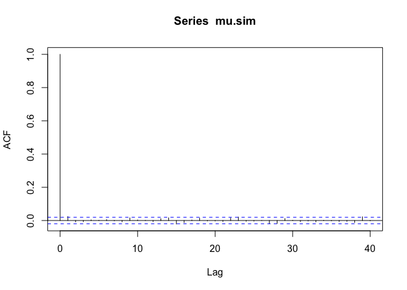
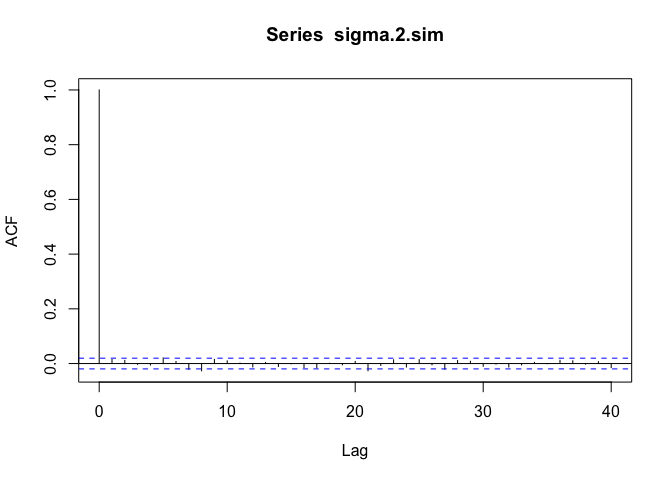
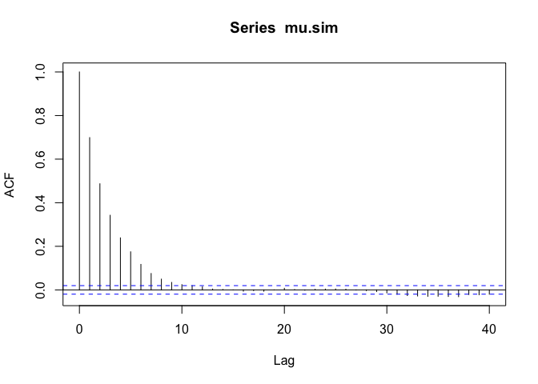
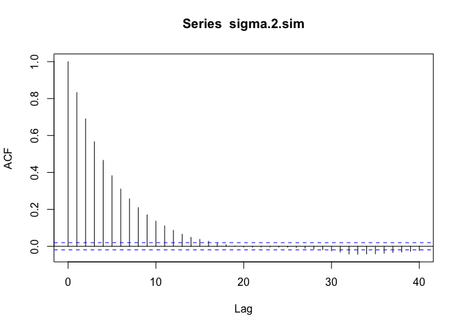
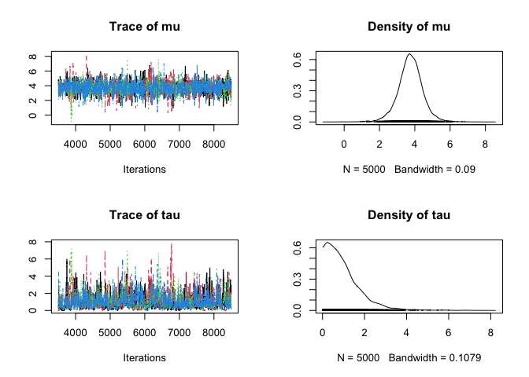
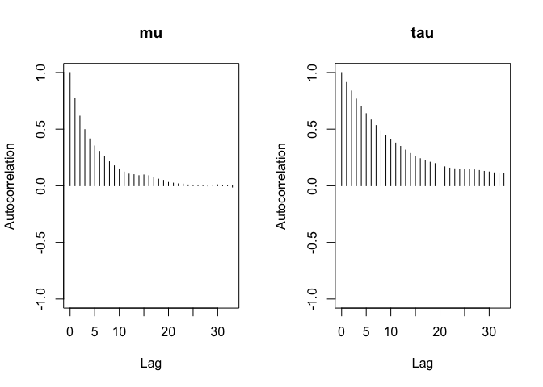
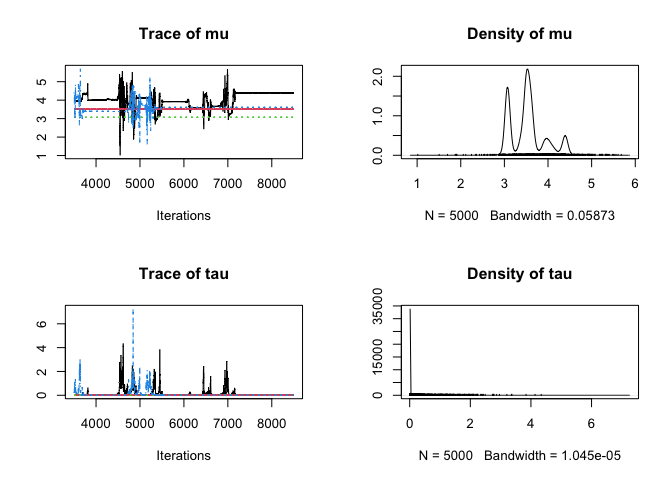
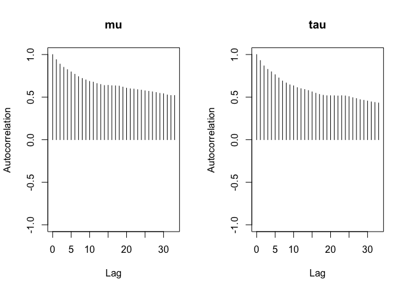

# Assignment 3

## Problem 1

### a. Simulates from the posteriors for $\mu$ and $\sigma^2$ and produce autocorrelation plots for their respective successive variates

::::: cell
``` {.r .cell-code}
source("./Flint Gibbs.r", echo = FALSE)
acf(mu.sim)
```

::: cell-output-display

:::

``` {.r .cell-code}
acf(sigma.2.sim)
```

::: cell-output-display

:::
:::::

### b. Metropolis sampler

#### i. Find a value of `rho` that gives an average acceptance rate of about $0.35$

-   With the `rho = 0.0308` the acceptance rate is around $0.35$

:::: cell
``` {.r .cell-code}
rho <- 0.0308
source("./Flint Metropolis.r", echo = FALSE)
mean(accept.prob)
```

::: {.cell-output .cell-output-stdout}
    [1] 0.3550203
:::
::::

#### ii. Plot the successive autocorrelation plots for $\mu$ and $\sigma^2$

::::: cell
``` {.r .cell-code}
acf(mu.sim)
```

::: cell-output-display

:::

``` {.r .cell-code}
acf(sigma.2.sim)
```

::: cell-output-display

:::
:::::

### c. Which method exhibited faster mixing

-   **The Gibbs Sampler** exhibited faster mixing as the autocorrelation
    drops within the significance bounds faster compared to the
    Metropolis Sampler.

## Problem 2

### a. Use the model in `polls20161.bug` for the following questions

#### i.

::::::::: cell
``` {.r .cell-code}
d <- read.table("./Polls 2016.txt", header=TRUE)

# variable init
d$sigma <- d$ME / 2

# JAGS
library(rjags)
```

::: {.cell-output .cell-output-stderr}
    Loading required package: coda
:::

::: {.cell-output .cell-output-stderr}
    Linked to JAGS 4.3.2
:::

::: {.cell-output .cell-output-stderr}
    Loaded modules: basemod,bugs
:::

``` {.r .cell-code}
initial.vals <- list(
    list(mu=100, tau=0.01),
    list(mu=100, tau=100),
    list(mu=-100, tau=0.01),
    list(mu=-100, tau=100)
)

ml <- jags.model(
    "./Polls 2016.bug", 
    d, 
    initial.vals, 
    n.chains=4, 
    n.adapt=1000
)
```

::: {.cell-output .cell-output-stderr}
    Warning in jags.model("./Polls 2016.bug", d, initial.vals, n.chains = 4, :
    Unused variable "poll" in data
:::

::: {.cell-output .cell-output-stderr}
    Warning in jags.model("./Polls 2016.bug", d, initial.vals, n.chains = 4, :
    Unused variable "ME" in data
:::

::: {.cell-output .cell-output-stdout}
    Compiling model graph
       Resolving undeclared variables
       Allocating nodes
    Graph information:
       Observed stochastic nodes: 7
       Unobserved stochastic nodes: 9
       Total graph size: 42

    Initializing model
:::
:::::::::

#### ii.

::: cell
``` {.r .cell-code}
update(ml, 2500) # burn-in

x <- coda.samples(ml, c("mu", "tau"), n.iter=5000)
```
:::

#### iii.

-   Based on the trace of `mu` and `tau`, there is no convergence
    problem.

:::: cell
``` {.r .cell-code}
plot(x, smooth=FALSE)
```

::: cell-output-display

:::
::::

#### iv.

-   Based on the result of the Gelman-Rubin statistics, both $\mu$ and
    $\tau$ have the point estimation around $1.00$, which indicates a
    close-to-perfect convergence.

:::: cell
``` {.r .cell-code}
gelman.diag(x, autoburnin=FALSE)
```

::: {.cell-output .cell-output-stdout}
    Potential scale reduction factors:

        Point est. Upper C.I.
    mu        1.00       1.00
    tau       1.01       1.01

    Multivariate psrf

    1
:::
::::

#### v.

:::: cell
``` {.r .cell-code}
# extract the first chain from x
first <- x[[1]]
autocorr.plot(first)
```

::: cell-output-display

:::
::::

#### vi.

-   Both are considered adequate as both of them exceed the suggested
    minimum value of $400$

:::: cell
``` {.r .cell-code}
effectiveSize(x)
```

::: {.cell-output .cell-output-stdout}
           mu       tau 
    2038.6485  811.8278 
:::
::::

### b. A new model that uses an almost flat prior for `tau` on the **log** scale

#### i.

``` r
model {

  for (j in 1:length(y)) {
    y[j] ~ dnorm(theta[j], 1/sigma[j]^2)
    theta[j] ~ dnorm(mu, 1/tau^2)
  }

  mu ~ dunif(-1000,1000)
  logtau ~ dunif(-100,100)
  tau <- exp(logtau)

}
```

#### ii.

:::::: cell
``` {.r .cell-code}
initial.vals <- list(
    list(mu=100, logtau=log(100)),
    list(mu=100, logtau=log(0.01)),
    list(mu=-100, logtau=log(100)),
    list(mu=-100, logtau=log(0.01))
)

ml <- jags.model(
    "./Polls 2016_2.bug",
    d, 
    initial.vals, 
    n.chains=4, 
    n.adapt=1000
)
```

::: {.cell-output .cell-output-stderr}
    Warning in jags.model("./Polls 2016_2.bug", d, initial.vals, n.chains = 4, :
    Unused variable "poll" in data
:::

::: {.cell-output .cell-output-stderr}
    Warning in jags.model("./Polls 2016_2.bug", d, initial.vals, n.chains = 4, :
    Unused variable "ME" in data
:::

::: {.cell-output .cell-output-stdout}
    Compiling model graph
       Resolving undeclared variables
       Allocating nodes
    Graph information:
       Observed stochastic nodes: 7
       Unobserved stochastic nodes: 9
       Total graph size: 44

    Initializing model
:::
::::::

#### iii.

::: cell
``` {.r .cell-code}
update(ml, 2500) # burn-in
x <- coda.samples(ml, c("mu", "tau"), n.iter=5000)
```
:::

#### iv.

-   Based on the trace of `mu` and `tau`, there is a convergence problem
    as the mixing of both variables are poor.
    -   `mu`: The chains remain in separate regions.
    -   `tau`: Most values are close to 0, with occasional spikes.

:::: cell
``` {.r .cell-code}
plot(x, smooth=FALSE)
```

::: cell-output-display

:::
::::

#### v.

-   Based on the result of the Gelman-Rubin statistics, both $\mu$ and
    $\tau$ have the point estimation greater than $1.1$, which indicates
    poor convergence.

:::: cell
``` {.r .cell-code}
gelman.diag(x, autoburnin=FALSE)
```

::: {.cell-output .cell-output-stdout}
    Potential scale reduction factors:

        Point est. Upper C.I.
    mu        2.57       7.53
    tau       1.17       1.41

    Multivariate psrf

    2.38
:::
::::

#### vi.

-   Based on the autocorrelation plots, the speed of mixing of both `mu`
    and `tau` is rather slow.

:::: cell
``` {.r .cell-code}
autocorr.plot(x[[1]])
```

::: cell-output-display

:::
::::

#### vii.

-   The problem with this model is that using an imporper flat prior on
    $log \tau$ implies $p(\tau) \propto \frac{1}{\tau}$, which is itself
    improper. This can lead to an improper posterior, which is not a
    valid probability. Such a model can cause poor convergence behavior
    like the statistical results above.
