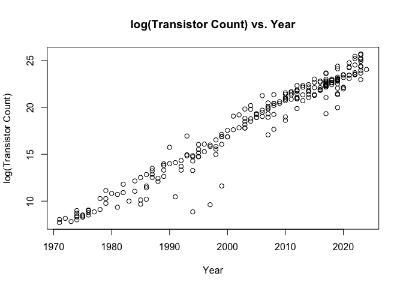
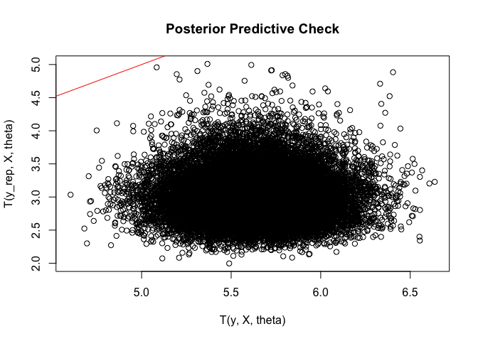

# Assignment 4

## Problem

According to one version of Moore’s law, the number of transistors on a
state-of-the-art computer microprocessor roughly doubles every two
years:

*C* ≈ *γ*2<sup>*A*/2</sup>

where

- *A*: the year number in which a microprocessor is introduced
- *C*: the transistor count of the microprocessor
- *γ*: a positive constant

Consider the **natural logarithm** of the transistor count: log *C*

------------------------------------------------------------------------

### a. Show that log *C* is roughly a simple linear regression and derive the coefficient of A

$$
\begin{aligned}
    \log C &\approx \log \gamma + \frac{A}{2} \log 2 \\
           &\approx \log \gamma + A \frac{1}{2} \log 2
\end{aligned}
$$

Given that the form of a simple linear regression is
*y* = *β*<sub>1</sub> + *x**β*<sub>2</sub> where *β*<sub>1</sub> and
*β*<sub>2</sub> are the parameters, log *C* is roughly a simple linear
regression with:

- *y* = log *C*
- *x* = *A*
- *β*<sub>1</sub> = log *γ*
- $\beta_2 = \frac{1}{2} \log 2 = 0.3465736$ **(the coefficient of A)**

### b. Plot the data points as log transistor count versus year

``` r
transistor <- read.csv("./Moores Law Data.csv", header = TRUE)
transistor$logC <- log(transistor$TransistorCount)
plot(
    x = transistor$Year, 
    y = transistor$logC, 
    main = "log(Transistor Count) vs. Year",
    ylab = "log(Transistor Count)",
    xlab = "Year"
)
```



### c. Consider a normal-theory simple linear regression model

log *C*<sub>*i*</sub> ∣ *β*, *σ*<sup>2</sup>*A*<sub>*i*</sub> ∼ *i**n**d**e**p*.  *N*(*β*<sub>1</sub> + *β*<sub>2</sub>(*A*<sub>*i*</sub> − *Ā*), *σ*<sup>2</sup>)  *i* = 1, …, 235

where

- *β*<sub>1</sub>, *β*<sub>2</sub>∼  *i**i**d*. *N*(0, 1000<sup>2</sup>)
- *σ*<sup>2</sup> ∼ Inv-gamma(0.001, 0.001)

#### i. List an appropriate JAGS model

``` r
model {
    for (i in 1:length(Year)) {
        logC[i] ~ dnorm(beta_1 + beta_2 * (Year[i] - AvgYear[i]), tau)
    }
    beta_1 ~ dnorm(0, 1/1000000)
    beta_2 ~ dnorm(0, 1/1000000)
    tau ~ dgamma(0.001, 0.001)
    sigma.2 <- 1 / tau 
}
```

------------------------------------------------------------------------

Now, run the model with overdispersed starting points, check
convergence, and monitor *β*<sub>1</sub>, *β*<sub>2</sub>, and
*σ*<sup>2</sup> for at least 2000 iterations after burn-in.

``` r
transistor$AvgYear = mean(transistor$Year)
init.vals <- list(
    list(beta_1=10000, beta_2=10000, tau=0.00001),
    list(beta_1=-10000, beta_2=-10000, tau=0.00001),
    list(beta_1=10000, beta_2=10000, tau=0.01),
    list(beta_1=-10000, beta_2=-10000, tau=0.01)
)

library(rjags)
```

    Loading required package: coda

    Linked to JAGS 4.3.2

    Loaded modules: basemod,bugs

``` r
ml <- jags.model("./regression.bug", transistor, init.vals, n.chains=4, n.adapt=1000)
```

    Warning in jags.model("./regression.bug", transistor, init.vals, n.chains = 4,
    : Unused variable "Processor" in data

    Warning in jags.model("./regression.bug", transistor, init.vals, n.chains = 4,
    : Unused variable "TransistorCount" in data

    Compiling model graph
       Resolving undeclared variables
       Allocating nodes
    Graph information:
       Observed stochastic nodes: 235
       Unobserved stochastic nodes: 3
       Total graph size: 876

    Initializing model

``` r
update(ml, 2500)
x <- coda.samples(ml, c("beta_1", "beta_2", "sigma.2"), n.iter=5000)

# verify convergence
gelman.diag(x, autoburnin=FALSE)
```

    Potential scale reduction factors:

            Point est. Upper C.I.
    beta_1           1          1
    beta_2           1          1
    sigma.2          1          1

    Multivariate psrf

    1

- As shown with the Gelman-Rubin convergence diagnostic, PSRF values
  equal to 1 for all parameters, indicating that MCMC chains have
  converged.

#### ii. List summary for *β*<sub>1</sub>, *β*<sub>2</sub>, and *σ*<sup>2</sup>

``` r
summary(x)
```


    Iterations = 2501:7500
    Thinning interval = 1 
    Number of chains = 4 
    Sample size per chain = 5000 

    1. Empirical mean and standard deviation for each variable,
       plus standard error of the mean:

               Mean       SD  Naive SE Time-series SE
    beta_1  18.3966 0.073246 5.179e-04      5.166e-04
    beta_2   0.3328 0.004895 3.461e-05      3.429e-05
    sigma.2  1.2469 0.116613 8.246e-04      8.356e-04

    2. Quantiles for each variable:

               2.5%     25%     50%     75%   97.5%
    beta_1  18.2529 18.3476 18.3960 18.4455 18.5416
    beta_2   0.3231  0.3295  0.3328  0.3361  0.3425
    sigma.2  1.0382  1.1653  1.2399  1.3213  1.4949

------------------------------------------------------------------------

#### iii. Give the approximate posterior **mean** and 95% **central posterior interval** for the slope

- Slope is the statistics related to *β*<sub>2</sub>

##### Slope Mean

``` r
summary(x)$statistics["beta_2", "Mean"]
```

    [1] 0.3327865

##### Slope 95% Central Posterior Interval

``` r
x_mat = as.matrix(x)
quantile(x_mat[,"beta_2"], c(0.025, 0.975))
```

         2.5%     97.5% 
    0.3231048 0.3425018 

- No, the coefficient of A does not fall within the interval. It goes
  slightly beyond the upper end, which suggests that the estimated
  growth in transistor count is slightly lower than Moore’s law.

------------------------------------------------------------------------

#### iv. Give the approximate posterior **mean** and 95% **central posterior interval** for the error variance

##### Slope Mean

``` r
summary(x)$statistics["sigma.2", "Mean"]
```

    [1] 1.246853

##### Slope 95% Central Posterior Interval

``` r
quantile(x_mat[,"sigma.2"], c(0.025, 0.975))
```

        2.5%    97.5% 
    1.038227 1.494883 

### d. Predict the transistor count

#### i. Update JAGS model to answer the subsequent questions

``` r
model {
    for (i in 1:length(Year)) {
        logC[i] ~ dnorm(beta_1 + beta_2 * (Year[i] - AvgYear[i]), tau)
    }
    beta_1 ~ dnorm(0, 1/1000000)
    beta_2 ~ dnorm(0, 1/1000000)
    tau ~ dgamma(0.001, 0.001)
    sigma.2 <- 1 / tau 

    mu_2026 <- beta_1 + beta_2 * (2026 - AvgYear[1])
    logC_2026 ~ dnorm(mu_2026, tau)
    C_2026 <- exp(logC_2026)
    C_2026_billions <- C_2026 / 1000000000

    invention_year <- AvgYear[1] - beta_1 / beta_2
}
```

``` r
ml <- jags.model("./regression_d.bug", transistor, init.vals, n.chains=4, n.adapt=1000)
```

    Warning in jags.model("./regression_d.bug", transistor, init.vals, n.chains =
    4, : Unused variable "Processor" in data

    Warning in jags.model("./regression_d.bug", transistor, init.vals, n.chains =
    4, : Unused variable "TransistorCount" in data

    Compiling model graph
       Resolving undeclared variables
       Allocating nodes
    Graph information:
       Observed stochastic nodes: 235
       Unobserved stochastic nodes: 4
       Total graph size: 886

    Initializing model

``` r
update(ml, 2500)
x <- coda.samples(ml, c("C_2026_billions", "invention_year"), n.iter=5000)

# verify convergence
gelman.diag(x, autoburnin=FALSE)
```

    Potential scale reduction factors:

                    Point est. Upper C.I.
    C_2026_billions          1          1
    invention_year           1          1

    Multivariate psrf

    1

------------------------------------------------------------------------

#### ii. List summary

``` r
summary(x)
```


    Iterations = 2501:7500
    Thinning interval = 1 
    Number of chains = 4 
    Sample size per chain = 5000 

    1. Empirical mean and standard deviation for each variable,
       plus standard error of the mean:

                      Mean       SD Naive SE Time-series SE
    C_2026_billions  230.1 381.9386 2.700714       2.718873
    invention_year  1949.3   0.8492 0.006005       0.005929

    2. Quantiles for each variable:

                       2.5%     25%    50%    75% 97.5%
    C_2026_billions   13.57   58.19  123.8  259.6  1113
    invention_year  1947.57 1948.69 1949.3 1949.8  1951

------------------------------------------------------------------------

#### iii. Give an approximate 95% central posterior predictive interval for the transistor count

``` r
x_mat <- as.matrix(x)
quantile(x_mat[,"C_2026_billions"], c(0.025, 0.975))
```

        2.5%    97.5% 
      13.572 1113.391 

------------------------------------------------------------------------

#### iv. Explain the following formula and give the 95% central posterior interval

$$
\bar A - \frac{\beta_1}{\beta_2}
$$

##### Proof

- When the transistor was invented, *C* = 1, which leads to log *C* = 0
- Therefore,

$$
\begin{align\*}
&\beta_1 + \beta_2 \* (A - \bar A) = 0 \\
&\beta_2 A = \beta_2 \bar A - \beta_1 \\
&A = \bar A - \frac{\beta_1}{\beta_2}
\end{align\*}
$$

##### 95% central posterior interval

``` r
quantile(x_mat[,"invention_year"], c(0.025, 0.975))
```

        2.5%    97.5% 
    1947.572 1950.873 

##### Actual year

- Transistor was invented in
  [1947](https://en.wikipedia.org/wiki/History_of_the_transistor), which
  falls within the 95% central posterior interval

### e. Check for outliers

*T*(*y*, *X*, *θ*) = max<sub>*i*</sub>|*ϵ*<sub>*i*</sub>/*σ*|

``` r
ml <- jags.model("./regression.bug", transistor, init.vals, n.chains=4, n.adapt=1000)
```

    Warning in jags.model("./regression.bug", transistor, init.vals, n.chains = 4,
    : Unused variable "Processor" in data

    Warning in jags.model("./regression.bug", transistor, init.vals, n.chains = 4,
    : Unused variable "TransistorCount" in data

    Compiling model graph
       Resolving undeclared variables
       Allocating nodes
    Graph information:
       Observed stochastic nodes: 235
       Unobserved stochastic nodes: 3
       Total graph size: 876

    Initializing model

``` r
update(ml, 2500)
x <- coda.samples(ml, c("beta_1", "beta_2", "sigma.2"), n.iter=5000)
x_mat <- as.matrix(x)
```

#### i. Compute simulated standardized error vectors *ϵ*/*σ*

``` r
n <- nrow(x_mat)
K <- length(transistor$logC)

eps_std <- matrix(NA, nrow = n, ncol = K)
for (s in 1:n) {
    beta1 <- x_mat[s, "beta_1"]
    beta2 <- x_mat[s, "beta_2"]
    sigma <- sqrt(x_mat[s, "sigma.2"])

    mu <- beta1 + beta2 * (transistor$Year - transistor$AvgYear)
    eps <- transistor$logC - mu
    eps_std[s,] <- eps / sigma
}
```

------------------------------------------------------------------------

#### ii. Compute simulated replicate standardized errors *ϵ*<sup>*r**e**p*</sup>/*σ*

``` r
eps_rep_std <- matrix(NA, nrow = n, ncol = K)
for (s in 1:n) {
    beta1 <- x_mat[s, "beta_1"]
    beta2 <- x_mat[s, "beta_2"]
    sigma <- sqrt(x_mat[s, "sigma.2"])

    mu <- beta1 + beta2 * (transistor$Year - transistor$AvgYear)
    y_rep <- rnorm(K, mean = mu, sd = sigma)
    eps_rep_std[s,] <- (y_rep - mu) / sigma
}
```

------------------------------------------------------------------------

#### iii. Compute *T*(*y*, *X*, *θ*) and *T*(*y*<sup>*r**e**p*</sup>, *X*, *θ*)

##### *T*(*y*, *X*, *θ*)

``` r
T <- apply(abs(eps_std), 1, max)
```

##### *T*(*y*<sup>*r**e**p*</sup>, *X*, *θ*)

``` r
T_rep <- apply(abs(eps_rep_std), 1, max)
```

#### iv. Plot *T*<sup>*r**e**p*</sup> vs *T*

``` r
plot(
    T, 
    T_rep,
    xlab = "T(y, X, theta)",
    ylab = "T(y_rep, X, theta)",
    main = "Posterior Predictive Check"
)
abline(0, 1, col = "red")
```



#### Calculate the p-value

``` r
mean(T_rep >= T)
```

    [1] 0

- As the p-value equals 0, the observed extremes are always greater than
  or equal to the posterior model extremes. Therefore, we can infer that
  there must be an outlier in the observed data.

#### Name the microprocessor that appears to be the most extreme outlier

``` r
x_stats = summary(x)$statistics
beta1_hat <- x_stats["beta_1", "Mean"]
beta2_hat <- x_stats["beta_2", "Mean"]
sigma_hat <- sqrt(x_stats["sigma.2", "Mean"])

mu_hat <- beta1_hat + beta2_hat * (transistor$Year - transistor$AvgYear)
std_resid <- abs((transistor$logC - mu_hat) / sigma_hat)

transistor[which.max(std_resid), "Processor"]
```

    [1] "F21"
