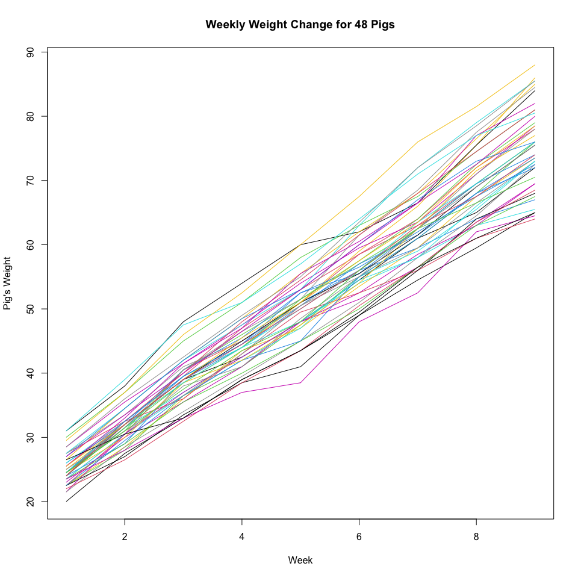
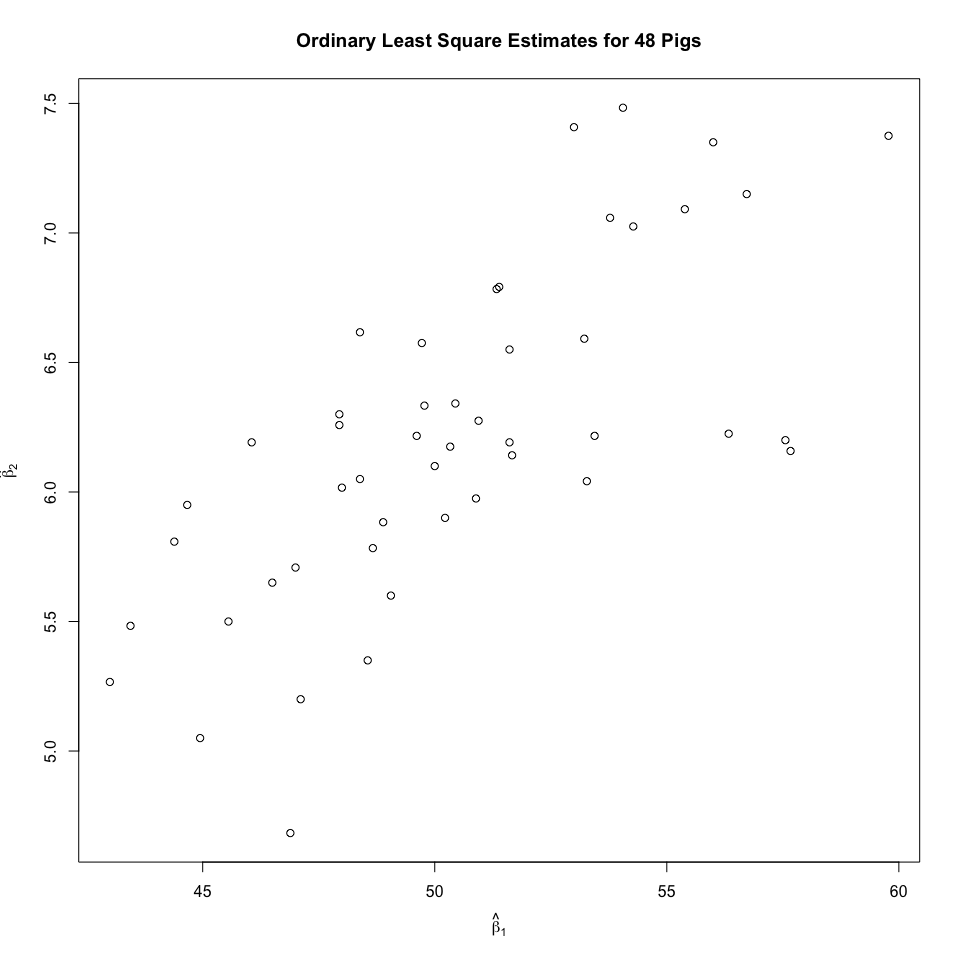
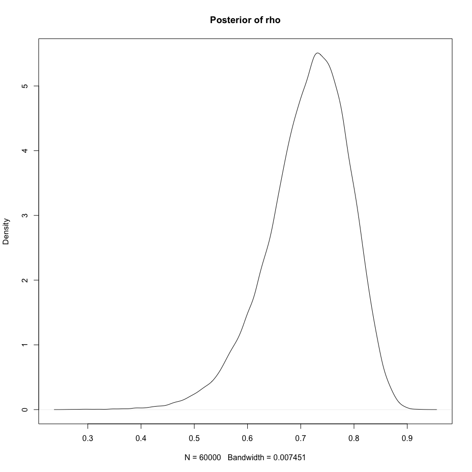

# Assignment 5

## Problem

File `pigweights.csv` contains weekly weights of 48 young pigs for each
of 9 consecutive weeks.1. You will build and compare two different
varying-coefficient hierarchical normal regression models for the
weights, using JAGS and rjags

### a. Represent the data as weight versus the week number

``` r
data <- read.csv("./Pig Weights.csv", header=TRUE)
matplot(
    t(data[, 2:10]), type="l", 
    col=1:nrow(data), lty=1, 
    xlab = "Week", 
    ylab="Pig's Weight", 
    main="Weekly Weight Change for 48 Pigs",
    xlim = range(1, 9)
)
```



### b. Use `lm` or `lsfit` in R to compute the following estimates

``` r
weeks <- 1:9
x_centered <- weeks - mean(weeks)
beta_hat <- matrix(NA, nrow=48, ncol=2)
colnames(beta_hat) <- c("beta1_hat", "beta2_hat")

# calculate the betas for each pig
for(j in 1:48) {
fit <- lm(as.numeric(data[j, 2:10]) ~ x_centered)
    beta_hat[j, ] <- coef(fit)
}
```

#### b.i. Scatter plot

``` r
plot(
    beta_hat[, "beta1_hat"], beta_hat[, "beta2_hat"],
    xlab = expression(hat(beta)[1]),
    ylab = expression(hat(beta)[2]),
    main = "Ordinary Least Square Estimates for 48 Pigs"
)
```



#### b.ii. Sample Means

``` r
colMeans(beta_hat)
```

    beta1_hat beta2_hat 
    50.405093  6.209896 

#### b.iii. Sample Variances

``` r
apply(beta_hat, 2, var)
```

     beta1_hat  beta2_hat 
    15.6301495  0.4066095 

#### b.iv. Sample Correlation

``` r
cor(beta_hat[, "beta1_hat"], beta_hat[, "beta2_hat"])
```

    [1] 0.7126639

### c. Bivariate Priors

``` r
y <- t(as.matrix(data[, 2:10]))
data_list <- list(
    y = y,
    N = 9,
    J = 48,
    x_centered = x_centered,
    zero = c(0, 0),
    mu_beta_precision = diag(2) * 1e-6,
    Tau0 = solve(matrix(c(15, 0, 0, 0.5), 2, 2)) / 2
)
```

#### c.i. JAGS Model

``` r
model_string <- "model {
    for (j in 1:J) {
        for (i in 1:N) {
            y[i, j] ~ dnorm(mu[i, j], tau_y)
            mu[i, j] <- beta1[j] + beta2[j] * x_centered[i]
        }

        beta[j, 1:2] ~ dmnorm(mu_beta[], Tau_beta[,])
        beta1[j] <- beta[j, 1]
        beta2[j] <- beta[j, 2]
    }
    
    mu_beta[1:2] ~ dmnorm(zero[], mu_beta_precision[,])
    Tau_beta[1:2, 1:2] ~ dwish(Tau0[,], 2)
    Sigma_beta[1:2, 1:2] <- inverse(Tau_beta[,])

    sigma1 <- sqrt(Sigma_beta[1, 1])
    sigma2 <- sqrt(Sigma_beta[2, 2])
    rho <- Sigma_beta[1, 2] / (sigma1 * sigma2)

    tau_y ~ dgamma(0.0001, 0.0001)
    sigma_y2 <- 1 / tau_y
}"
```

where:

- *Σ*<sub>*β*</sub>: `Sigma_beta[1:2, 1:2] <- inverse(Tau_beta[,])`
- *Σ*<sub>*β*</sub><sup>−1</sup>: `Tau_beta[1:2, 1:2]`
- *ρ*: `rho <- Sigma_beta[1, 2] / (sigma1 * sigma2)`
- *σ*<sub>*y*</sub><sup>2</sup>: `tau_y ~ dgamma(0.0001, 0.0001)`

#### c.ii. Display the coda summary of the results for the monitored parameters.

``` r
library(rjags)
```

    Loading required package: coda

    Linked to JAGS 4.3.2

    Loaded modules: basemod,bugs

``` r
# run the model
model <- jags.model(
  textConnection(model_string),
  data = data_list,
  n.chains = 3
)
```

    Compiling model graph
       Resolving undeclared variables
       Allocating nodes
    Graph information:
       Observed stochastic nodes: 432
       Unobserved stochastic nodes: 51
       Total graph size: 1479

    Initializing model

``` r
update(model, 5000) 

# get the monitored params
samples <- coda.samples(
  model,
  variable.names = c("mu_beta", "Sigma_beta", "sigma_y2", "rho"),
  n.iter = 20000
)
summary(samples)
```


    Iterations = 5001:25000
    Thinning interval = 1 
    Number of chains = 3 
    Sample size per chain = 20000 

    1. Empirical mean and standard deviation for each variable,
       plus standard error of the mean:

                       Mean      SD  Naive SE Time-series SE
    Sigma_beta[1,1] 15.7520 3.39393 0.0138557      0.0144469
    Sigma_beta[2,1]  1.8292 0.48272 0.0019707      0.0020835
    Sigma_beta[1,2]  1.8292 0.48272 0.0019707      0.0020835
    Sigma_beta[2,2]  0.4135 0.09325 0.0003807      0.0004270
    mu_beta[1]      50.4044 0.57592 0.0023512      0.0023587
    mu_beta[2]       6.2100 0.09592 0.0003916      0.0004135
    rho              0.7137 0.07695 0.0003142      0.0003651
    sigma_y2         1.6061 0.12444 0.0005080      0.0006360

    2. Quantiles for each variable:

                       2.5%     25%     50%     75%   97.5%
    Sigma_beta[1,1] 10.4619 13.3388 15.3099 17.6676 23.5962
    Sigma_beta[2,1]  1.0614  1.4891  1.7700  2.1042  2.9402
    Sigma_beta[1,2]  1.0614  1.4891  1.7700  2.1042  2.9402
    Sigma_beta[2,2]  0.2681  0.3476  0.4009  0.4661  0.6292
    mu_beta[1]      49.2677 50.0224 50.4040 50.7859 51.5418
    mu_beta[2]       6.0222  6.1460  6.2100  6.2739  6.4000
    rho              0.5402  0.6685  0.7221  0.7686  0.8395
    sigma_y2         1.3814  1.5193  1.5996  1.6856  1.8681

#### c.iii. Show 95% central posterior interval for the correlation parameter, and also produce a graph of its (approximated) posterior density.

``` r
sample_mat <- as.matrix(samples)
rho <- sample_mat[, "rho"]
quantile(rho, c(0.025, 0.975))
```

         2.5%     97.5% 
    0.5402316 0.8395482 

``` r
plot(density(rho), main="Posterior of rho")
abline(v=0)
```



- Given that the credible interval does not include zero and that the
  density distribution of the correlation between the intercept and
  slope across pigs is entirely above zero, it is a good idea to allow
  *ρ* to be nonzero.

#### c.iv. Show 95% central posterior interval for expected weight at week 1

``` r
mu1 <- sample_mat[, "mu_beta[1]"]
mu2 <- sample_mat[, "mu_beta[2]"]

x1_centered <- 1 - mean(weeks)
expected_weight <- mu1 + mu2 * x1_centered
quantile(expected_weight, c(0.025, 0.975))
```

        2.5%    97.5% 
    24.75395 26.37761 

#### c.v. Show 95% central posterior interval for population variance at week 1

``` r
sigma1_sq <- sample_mat[, "Sigma_beta[1,1]"]
sigma2_sq <- sample_mat[, "Sigma_beta[2,2]"]
rho <- sample_mat[, "rho"]

sigma1 <- sqrt(sigma1_sq)
sigma2 <- sqrt(sigma2_sq)

var_week1 <- sigma1_sq +
                2 * x1_centered * rho * sigma1 * sigma2 + 
                (x1_centered^2) * sigma2_sq

quantile(var_week1, c(0.025, 0.975))
```

         2.5%     97.5% 
     4.950863 11.883224 

#### c.vi. Approximate the posterior probability that *x*<sub>*m**i**n*</sub> \< 1

``` r
x_min <- mean(weeks) - (rho * sigma1/ sigma2)
post_prob <- mean(x_min < 1)
post_prob
```

    [1] 0.7442167

#### c.vii. Approximate the Bayes Factor favoring *x*<sub>*m*</sub>*i**n* \< 1 over *x*<sub>*m*</sub>*i**n* \> 1

``` r
prior_prob <- 0.205

posterior_odds <- post_prob / (1 - post_prob)
prior_odds <- prior_prob / (1 - prior_prob)

bayes_factor <- posterior_odds / prior_odds
bayes_factor
```

    [1] 11.28341

#### c.viii.

``` r
dic <- dic.samples(
  model,
  n.iter = 1000000,
  type = "pD"
)
dic
```

    Mean deviance:  1429 
    penalty 91.09 
    Penalized deviance: 1520 

### d. Univariate hyperpriors

#### d.i. Draw a DAG

<figure>

<figcaption aria-hidden="true">DAG diagram</figcaption>
</figure>

#### d.ii. JAGS Model

``` r
model_string <- "model {
    for (j in 1:J) {
        for (i in 1:N) {
            y[i, j] ~ dnorm(mu[i, j], tau_y)
            mu[i, j] <- beta1[j] + beta2[j] * x_centered[i]
        }

        beta1[j] ~ dnorm(mu_beta1, tau_beta1)
        beta2[j] ~ dnorm(mu_beta2, tau_beta2)
    }
    
    mu_beta1 ~ dnorm(0, 1.0E-6)
    mu_beta2 ~ dnorm(0, 1.0E-6)

    sigma_beta1 ~ dunif(0, 1000)
    sigma_beta2 ~ dunif(0, 1000)

    sigma_beta1_sq <- pow(sigma_beta1, 2)
    sigma_beta2_sq <- pow(sigma_beta2, 2)

    tau_beta1 <- 1 / sigma_beta1_sq
    tau_beta2 <- 1 / sigma_beta2_sq

    tau_y ~ dgamma(0.0001, 0.0001)
    sigma_y2 <- 1 / tau_y
}"
```

#### d.iii. Show the summary

``` r
# run the model
model <- jags.model(
  textConnection(model_string),
  data = data_list,
  n.chains = 3
)
```

    Warning in jags.model(textConnection(model_string), data = data_list, n.chains
    = 3): Unused variable "zero" in data

    Warning in jags.model(textConnection(model_string), data = data_list, n.chains
    = 3): Unused variable "mu_beta_precision" in data

    Warning in jags.model(textConnection(model_string), data = data_list, n.chains
    = 3): Unused variable "Tau0" in data

    Compiling model graph
       Resolving undeclared variables
       Allocating nodes
    Graph information:
       Observed stochastic nodes: 432
       Unobserved stochastic nodes: 101
       Total graph size: 1419

    Initializing model

``` r
update(model, 5000)

samples <- coda.samples(
  model,
  variable.names = c(
    "mu_beta1", "mu_beta2",
    "sigma_beta1_sq", "sigma_beta2_sq",
    "sigma_y2"
  ),
  n.iter = 20000
)

summary(samples)
```


    Iterations = 6001:26000
    Thinning interval = 1 
    Number of chains = 3 
    Sample size per chain = 20000 

    1. Empirical mean and standard deviation for each variable,
       plus standard error of the mean:

                      Mean      SD  Naive SE Time-series SE
    mu_beta1       50.4049 0.59158 0.0024151      0.0024418
    mu_beta2        6.2094 0.09531 0.0003891      0.0004157
    sigma_beta1_sq 16.5131 3.63407 0.0148360      0.0196598
    sigma_beta2_sq  0.4067 0.09432 0.0003851      0.0005013
    sigma_y2        1.6064 0.12507 0.0005106      0.0006419

    2. Quantiles for each variable:

                      2.5%     25%     50%     75%   97.5%
    mu_beta1       49.2430 50.0105 50.4064 50.7983 51.5729
    mu_beta2        6.0220  6.1463  6.2097  6.2723  6.3972
    sigma_beta1_sq 10.8568 13.9182 16.0350 18.5568 24.9860
    sigma_beta2_sq  0.2597  0.3399  0.3944  0.4593  0.6243
    sigma_y2        1.3805  1.5194  1.5998  1.6867  1.8690

#### d.iv. Show 95% central posterior interval for expected weight at week 1

``` r
sample_mat <- as.matrix(samples)
mu1 <- sample_mat[, "mu_beta1"]
mu2 <- sample_mat[, "mu_beta2"]

x1_centered <- 1 - mean(weeks)
expected_weight <- mu1 + mu2 * x1_centered
quantile(expected_weight, c(0.025, 0.975))
```

        2.5%    97.5% 
    24.17339 26.95632 

- Compared to the previous result where the correlation *ρ* may not be
  zero, the 95% central posterior interval for expected weight at week 1
  barely change after forcing independence of the hyperpriors, which
  indicates that allowing for correlation between intercept and slope
  has little impact.

#### d.v. Show the DIC

``` r
dic <- dic.samples(
  model,
  n.iter = 1000000,
  type = "pD"
)
dic
```

    Mean deviance:  1430 
    penalty 94.19 
    Penalized deviance: 1524 

- Compared to the previous result, DIC barely changes after forcing the
  independence of the hyperpriors. We can conclude that the data
  themselves are sufficiently informative to estimate the
  population-level parameters regardless of the correlation between
  intercept and slope. Therefore, simpler model with independent
  hyperpriors is sufficient in this case.
