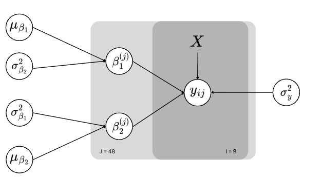

# Assignment 5

## Problem 

File `pigweights.csv` contains weekly weights of 48 young pigs for each of 9 consecutive weeks.1. You will build and compare two different varying-coefficient hierarchical normal regression models for the weights, using JAGS and rjags

### a. Represent the data as weight versus the week number 

```{r}
#| fig-width: 10
#| fig-height: 10

data <- read.csv("./Pig Weights.csv", header=TRUE)
matplot(
    t(data[, 2:10]), type="l", 
    col=1:nrow(data), lty=1, 
    xlab = "Week", 
    ylab="Pig's Weight", 
    main="Weekly Weight Change for 48 Pigs",
    xlim = range(1, 9)
)
```

### b. Use `lm` or `lsfit` in R to compute the following estimates

```{r}
weeks <- 1:9
x_centered <- weeks - mean(weeks)
beta_hat <- matrix(NA, nrow=48, ncol=2)
colnames(beta_hat) <- c("beta1_hat", "beta2_hat")

# calculate the betas for each pig
for(j in 1:48) {
fit <- lm(as.numeric(data[j, 2:10]) ~ x_centered)
    beta_hat[j, ] <- coef(fit)
}
```

#### b.i. Scatter plot 

```{r}
#| fig-width: 10
#| fig-height: 10
plot(
    beta_hat[, "beta1_hat"], beta_hat[, "beta2_hat"],
    xlab = expression(hat(beta)[1]),
    ylab = expression(hat(beta)[2]),
    main = "Ordinary Least Square Estimates for 48 Pigs"
)
```

#### b.ii. Sample Means 

```{r}
colMeans(beta_hat)
```


#### b.iii. Sample Variances

```{r}
apply(beta_hat, 2, var)
```


#### b.iv. Sample Correlation 

```{r}
cor(beta_hat[, "beta1_hat"], beta_hat[, "beta2_hat"])
```


### c. Bivariate Priors

```{r}
y <- t(as.matrix(data[, 2:10]))
data_list <- list(
    y = y,
    N = 9,
    J = 48,
    x_centered = x_centered,
    zero = c(0, 0),
    mu_beta_precision = diag(2) * 1e-6,
    Tau0 = solve(matrix(c(15, 0, 0, 0.5), 2, 2)) / 2
)
```

#### c.i. JAGS Model

```{r}
model_string <- "model {
    for (j in 1:J) {
        for (i in 1:N) {
            y[i, j] ~ dnorm(mu[i, j], tau_y)
            mu[i, j] <- beta1[j] + beta2[j] * x_centered[i]
        }

        beta[j, 1:2] ~ dmnorm(mu_beta[], Tau_beta[,])
        beta1[j] <- beta[j, 1]
        beta2[j] <- beta[j, 2]
    }
    
    mu_beta[1:2] ~ dmnorm(zero[], mu_beta_precision[,])
    Tau_beta[1:2, 1:2] ~ dwish(Tau0[,], 2)
    Sigma_beta[1:2, 1:2] <- inverse(Tau_beta[,])

    sigma1 <- sqrt(Sigma_beta[1, 1])
    sigma2 <- sqrt(Sigma_beta[2, 2])
    rho <- Sigma_beta[1, 2] / (sigma1 * sigma2)

    tau_y ~ dgamma(0.0001, 0.0001)
    sigma_y2 <- 1 / tau_y
}"
```

where:

- $\Sigma_\beta:$ `Sigma_beta[1:2, 1:2] <- inverse(Tau_beta[,])`
- $\Sigma_\beta^{-1}:$ `Tau_beta[1:2, 1:2]`
- $\rho:$ `rho <- Sigma_beta[1, 2] / (sigma1 * sigma2)`
- $\sigma^2_y:$ `tau_y ~ dgamma(0.0001, 0.0001)`

#### c.ii.  Display the coda summary of the results for the monitored parameters.

```{r}
library(rjags)

# run the model
model <- jags.model(
  textConnection(model_string),
  data = data_list,
  n.chains = 3
)

update(model, 5000) 

# get the monitored params
samples <- coda.samples(
  model,
  variable.names = c("mu_beta", "Sigma_beta", "sigma_y2", "rho"),
  n.iter = 20000
)
summary(samples)
```

#### c.iii. Show 95% central posterior interval for the correlation parameter, and also produce a graph of its (approximated) posterior density.

```{r}
sample_mat <- as.matrix(samples)
rho <- sample_mat[, "rho"]
quantile(rho, c(0.025, 0.975))
```

```{r}
#| fig-width: 10
#| fig-height: 10
plot(density(rho), main="Posterior of rho")
abline(v=0)
```

- Given that the credible interval does not include zero and that the density distribution of the correlation between the intercept and slope across pigs is entirely above zero, it is a good idea to allow $\rho$ to be nonzero. 

#### c.iv. Show 95% central posterior interval for expected weight at week 1

```{r}
mu1 <- sample_mat[, "mu_beta[1]"]
mu2 <- sample_mat[, "mu_beta[2]"]

x1_centered <- 1 - mean(weeks)
expected_weight <- mu1 + mu2 * x1_centered
quantile(expected_weight, c(0.025, 0.975))
```

#### c.v. Show 95% central posterior interval for population variance at week 1

```{r}
sigma1_sq <- sample_mat[, "Sigma_beta[1,1]"]
sigma2_sq <- sample_mat[, "Sigma_beta[2,2]"]
rho <- sample_mat[, "rho"]

sigma1 <- sqrt(sigma1_sq)
sigma2 <- sqrt(sigma2_sq)

var_week1 <- sigma1_sq +
                2 * x1_centered * rho * sigma1 * sigma2 + 
                (x1_centered^2) * sigma2_sq

quantile(var_week1, c(0.025, 0.975))
```

#### c.vi. Approximate the posterior probability that $x_{min} < 1$

```{r}
x_min <- mean(weeks) - (rho * sigma1/ sigma2)
post_prob <- mean(x_min < 1)
post_prob
```

#### c.vii. Approximate the Bayes Factor favoring $x_min < 1$ over $x_min > 1$

```{r}
prior_prob <- 0.205

posterior_odds <- post_prob / (1 - post_prob)
prior_odds <- prior_prob / (1 - prior_prob)

bayes_factor <- posterior_odds / prior_odds
bayes_factor
```

#### c.viii. 

```{r}
dic <- dic.samples(
  model,
  n.iter = 1000000,
  type = "pD"
)
dic
```

### d. Univariate hyperpriors

#### d.i. Draw a DAG



#### d.ii. JAGS Model

```{r}
model_string <- "model {
    for (j in 1:J) {
        for (i in 1:N) {
            y[i, j] ~ dnorm(mu[i, j], tau_y)
            mu[i, j] <- beta1[j] + beta2[j] * x_centered[i]
        }

        beta1[j] ~ dnorm(mu_beta1, tau_beta1)
        beta2[j] ~ dnorm(mu_beta2, tau_beta2)
    }
    
    mu_beta1 ~ dnorm(0, 1.0E-6)
    mu_beta2 ~ dnorm(0, 1.0E-6)

    sigma_beta1 ~ dunif(0, 1000)
    sigma_beta2 ~ dunif(0, 1000)

    sigma_beta1_sq <- pow(sigma_beta1, 2)
    sigma_beta2_sq <- pow(sigma_beta2, 2)

    tau_beta1 <- 1 / sigma_beta1_sq
    tau_beta2 <- 1 / sigma_beta2_sq

    tau_y ~ dgamma(0.0001, 0.0001)
    sigma_y2 <- 1 / tau_y
}"
```

#### d.iii. Show the summary 

```{r}
# run the model
model <- jags.model(
  textConnection(model_string),
  data = data_list,
  n.chains = 3
)

update(model, 5000)

samples <- coda.samples(
  model,
  variable.names = c(
    "mu_beta1", "mu_beta2",
    "sigma_beta1_sq", "sigma_beta2_sq",
    "sigma_y2"
  ),
  n.iter = 20000
)

summary(samples)
```


#### d.iv. Show 95% central posterior interval for expected weight at week 1

```{r}
sample_mat <- as.matrix(samples)
mu1 <- sample_mat[, "mu_beta1"]
mu2 <- sample_mat[, "mu_beta2"]

x1_centered <- 1 - mean(weeks)
expected_weight <- mu1 + mu2 * x1_centered
quantile(expected_weight, c(0.025, 0.975))
```

- Compared to the previous result where the correlation $\rho$ may not be zero, the 95% central posterior interval for expected weight at week 1 barely change after forcing independence of the hyperpriors, which indicates that allowing for correlation between intercept and slope has little impact.


#### d.v. Show the DIC

```{r}
dic <- dic.samples(
  model,
  n.iter = 1000000,
  type = "pD"
)
dic
```

- Compared to the previous result, DIC barely changes after forcing the independence of the hyperpriors. We can conclude that the data themselves are sufficiently informative to estimate the population-level parameters regardless of the correlation between intercept and slope. Therefore, simpler model with independent hyperpriors is sufficient in this case.
